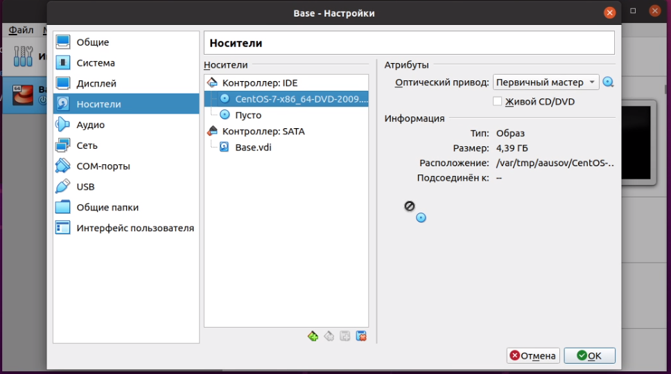
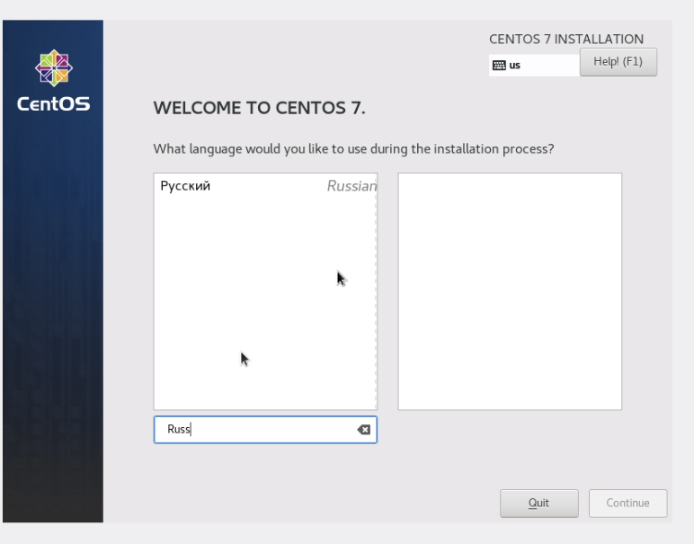
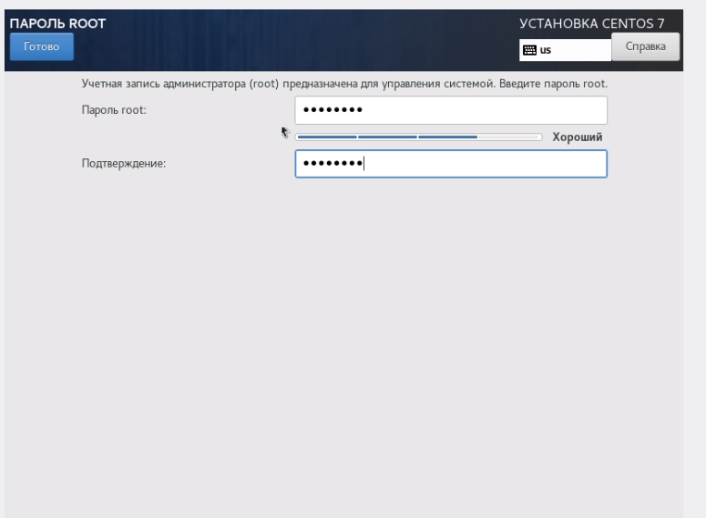
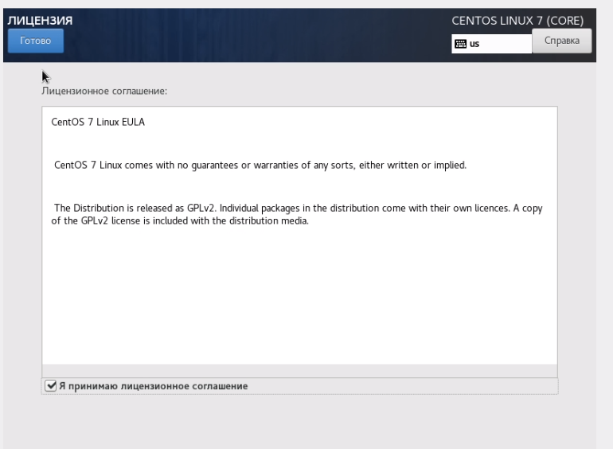
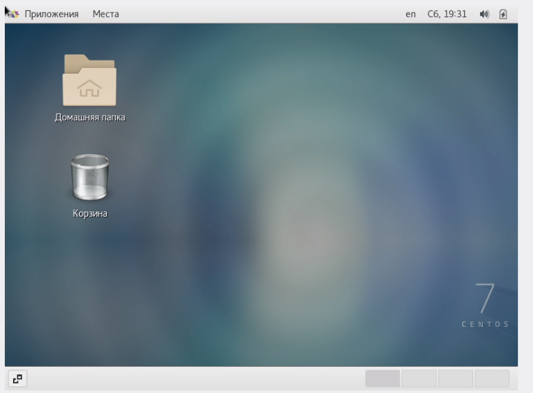

---
# Front matter
title: "Лабораторнаяработа № 1"
subtitle: "Установка и конфигурация операционной системы на виртуальную машину"
author: "Усов Александр Александрович НБибд-02-18"

# Generic otions
lang: ru-RU
toc-title: "Содержание"

# Bibliography
bibliography: bib/cite.bib
csl: pandoc/csl/gost-r-7-0-5-2008-numeric.csl

# Pdf output format
toc: true # Table of contents
toc_depth: 2
lof: true # List of figures
lot: true # List of tables
fontsize: 12pt
linestretch: 1.5
papersize: a4
documentclass: scrreprt
## I18n
polyglossia-lang:
  name: russian
  options:
	- spelling=modern
	- babelshorthands=true
polyglossia-otherlangs:
  name: english
### Fonts
mainfont: PT Serif
romanfont: PT Serif
sansfont: PT Sans
monofont: PT Mono
mainfontoptions: Ligatures=TeX
romanfontoptions: Ligatures=TeX
sansfontoptions: Ligatures=TeX,Scale=MatchLowercase
monofontoptions: Scale=MatchLowercase,Scale=0.9
## Biblatex
biblatex: true
biblio-style: "gost-numeric"
biblatexoptions:
  - parentracker=true
  - backend=biber
  - hyperref=auto
  - language=auto
  - autolang=other*
  - citestyle=gost-numeric
## Misc options
indent: true
header-includes:
  - \linepenalty=10 # the penalty added to the badness of each line within a paragraph (no associated penalty node) Increasing the value makes tex try to have fewer lines in the paragraph.
  - \interlinepenalty=0 # value of the penalty (node) added after each line of a paragraph.
  - \hyphenpenalty=50 # the penalty for line breaking at an automatically inserted hyphen
  - \exhyphenpenalty=50 # the penalty for line breaking at an explicit hyphen
  - \binoppenalty=700 # the penalty for breaking a line at a binary operator
  - \relpenalty=500 # the penalty for breaking a line at a relation
  - \clubpenalty=150 # extra penalty for breaking after first line of a paragraph
  - \widowpenalty=150 # extra penalty for breaking before last line of a paragraph
  - \displaywidowpenalty=50 # extra penalty for breaking before last line before a display math
  - \brokenpenalty=100 # extra penalty for page breaking after a hyphenated line
  - \predisplaypenalty=10000 # penalty for breaking before a display
  - \postdisplaypenalty=0 # penalty for breaking after a display
  - \floatingpenalty = 20000 # penalty for splitting an insertion (can only be split footnote in standard LaTeX)
  - \raggedbottom # or \flushbottom
  - \usepackage{float} # keep figures where there are in the text
  - \floatplacement{figure}{H} # keep figures where there are in the text
---

# Цель работы
Приобретение практических навыков установки операционной системы на виртуальную машину, настройки минимально необходимых для дальнейшей работы сервисов.

# Задание

1. Запустить терминал. Перейти в каталог /var/tmp
2. Создать каталог с именем пользователя (желательно совпадающим с логи-ном студента в дисплейном классе)
3. Скопировать образ виртуальной машины в папку, созданную на предыдущем шаге.
4. Ностроить VirtualBox
5. Запустить виртуальную машину и установить систему

# Теоретическое введение

CentOS ( от англ. Community ENTerprise Operating System) — дистрибутив Linux, основанный на коммерческом Red Hat Enterprise Linux компании Red Hat и совместимый с ним. Согласно жизненному циклу Red Hat Enterprise Linux (RHEL), CentOS 5, 6 и 7 будут поддерживаться «до 10 лет», поскольку они основаны на RHEL. Ранее версия CentOS 4 поддерживалась семь лет.

Red Hat Enterprise Linux состоит из свободного ПО с открытым кодом, но доступен в виде дисков с бинарными пакетами только для платных подписчиков. Как требуется в лицензии GPL и других, Red Hat предоставляет все исходные коды. Разработчики CentOS используют данный исходный код для создания окончательного продукта, очень близкого к Red Hat Enterprise Linux и доступного для загрузки. Существуют и другие клоны Red Hat Enterprise Linux, созданные на основе этого кода.

CentOS использует программу Yum для загрузки и установки обновлений из репозитория CentOS Mirror Network, тогда как Red Hat Enterprise Linux получают обновления с серверов Red Hat Network. CentOS до версии 5.0 для обновлений использовал также программу up2date[en].

Помимо прочего, CentOS использовалась как ОС по умолчанию в проекте Cluster Compute Instance (CCI) от Amazon, суть которого заключается в том, что сдаются в аренду мощности большого числа стандартных стоечных серверов.

Компания Red Hat объявила о прекращении разработки дистрибутива CentOS 8 в своём классическом варианте, подразумевающем предоставление максимально приближенных пересборок выпусков Red Hat Enterprise Linux.

Формирование обновлений для классического CentOS 8 будет прекращено 31 декабря 2021 года. Сопровождение ветки CentOS 7 будет продолжено без изменений до 2024 года.

Вместо классического CentOS пользователям будет предложено перейти на непрерывно обновляемую редакцию CentOS Stream.

В ответ на трансформацию стабильной платформы CentOS в тестовый роллинг дистрибутив CentOS Stream, Грегори Курцер (Gregory Kurtzer), основатель проекта CentOS, сообщил о намерении создать новую пересборку RHEL и пригласил других разработчиков присоединиться к данной инициативе.

Для ведения разработки нового дистрибутива Грегори зарегистрировал домен rockylinux и создал репозиторий на GitHub.

Также, компания CloudLinux, планирует выпустить альтернативу CentOS 8 под наименованием AlmaLinux, бинарно совместимую с RHEL. Дистрибутив будет базироваться на пакетной базе Red Hat Enterprise Linux 8. Первый выпуск дистрибутива обещают сформировать в течение первого квартала 2021 года.
Более подробно о CentO см. в [@wiki:centos].

# Выполнение лабораторной работы

На моём пк установлена Ubuntu Ubuntu 20.04.3 LTS, поэтому все шаги я могу выполнить согласно лабораторной работе

1. Загрузить операционную систему Linux. Осуществил вход в систему.

2. Запустил терминал. Перешел в каталог /var/tmp

3. Создал каталог с именем пользователя

4. Скопировал образ виртуальной машины в созданный на предыдущем шаге каталог (рис. [-@fig:001])

{ #fig:001 width=70% }

5. Запустил виртуальную машину (рис. [-@fig:002])

{ #fig:002 width=70% } 

6. Проверил в свойствах VirtualBox месторасположение каталога для виртуальных машин. 
(рис. [-@fig:003])

.png){ #fig:003 width=70% } 

7. Создал новую виртуальную машину

{ #fig:004 width=70% }

{ #fig:005 width=70% } 

{ #fig:006 width=70% }

{ #fig:007 width=70% }

{ #fig:008 width=70% }

{ #fig:009 width=70% }

8. Выбрал в VirtualBox Свойства Носители виртуальной машины Base. Добавил новый привод оптических дисков и выбрал образ.(рис. [-@fig:010])

{ #fig:010 width=70% }

9. Запустил установку системы

10. Установил русский язык для интерфейса и раскладку клавиатуры (рис. [-@fig:011])

{ #fig:011 width=70% }

11. Указал часовой пояс(рис. [-@fig:012])

{ #fig:012 width=70% }

12. Выбрал программы для установки(рис. [-@fig:013])

{ #fig:013 width=70% }

{ #fig:014 width=70% }

13. Начал установку. (рис. [-@fig:015]) Задал root пароль (рис. [-@fig:016]) и создал пользователя-администратора со своим именем (рис. [-@fig:017])

{ #fig:015 width=70% }

{ #fig:016 width=70% }

{ #fig:017 width=70% }

{ #fig:018 width=70% }

{ #fig:019 width=70% }

14. Принял лицензию (рис. [-@fig:021])

{ #fig:020 width=70% }

{ #fig:021 width=70% }

15. Войти в систему 

{ #fig:022 width=70% }

{ #fig:023 width=70% }

16. Установить обновления

{ #fig:024 width=70% }

{ #fig:025 width=70% }

17. Установить программу (Например, mc)

{ #fig:026 width=70% }

{ #fig:027 width=70% }

18. Для того чтобы другие виртуальные машины могли использоватьмашину Base и её конфигурацию как базовую, необходимо произвести следующие действия. В VirtualBox в меню выбрать Файл > Менеджер виртуальных носителей > Жёсткие диски и, выделив «Base.dvi», указать Освободить (При выполнении данных действий получена ошибка (рис. [-@fig:028]))

{ #fig:028 width=70% }

# Выводы

Выполняя данную лабораторную работу, я приобрел навыки установки CentOS 7 на виртуальную машину и настройки минимально необхлдимых для дальнейшей работы сервисов.

# Список литературы{.unnumbered}

::: {#refs}
:::
