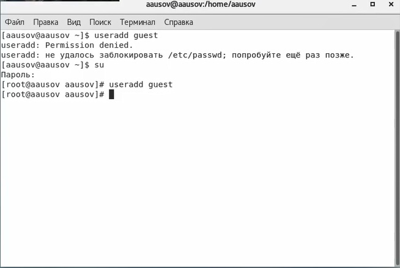
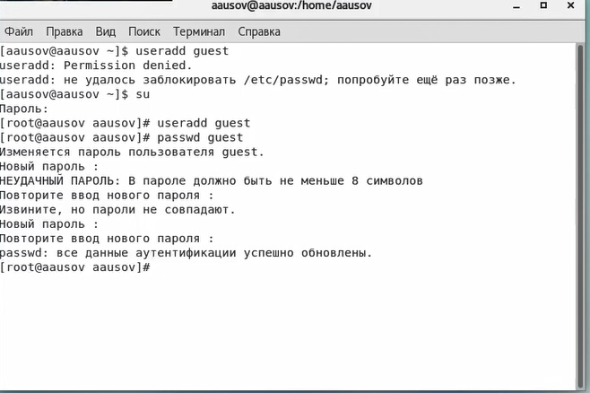
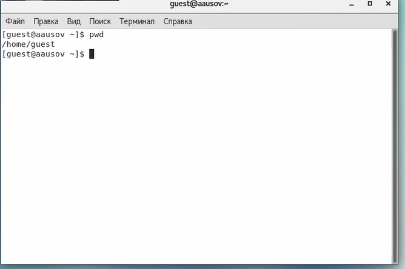
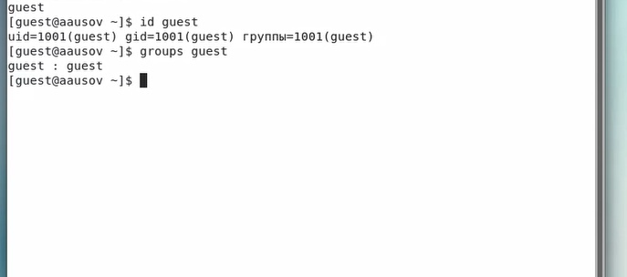
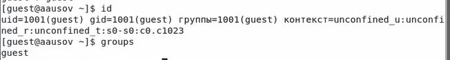
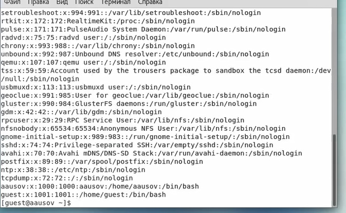
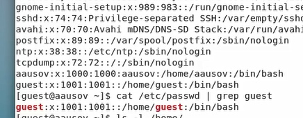
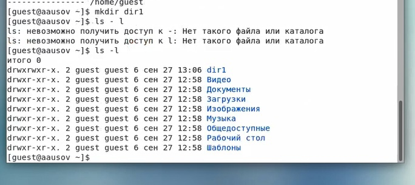
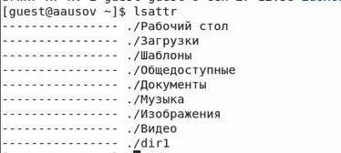
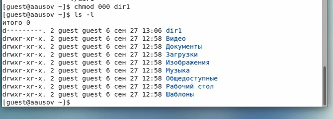

# Front matter
title: "Лабораторнаяработа № 2"
subtitle: "Дискреционное разграничение прав в Linux. Основные атрибуты"
author: "Усов Александр Александрович НБибд-02-18"

# Generic otions
lang: ru-RU
toc-title: "Содержание"

# Bibliography
bibliography: bib/cite.bib
csl: pandoc/csl/gost-r-7-0-5-2008-numeric.csl

# Pdf output format
toc: true # Table of contents
toc_depth: 2
lof: true # List of figures
lot: true # List of tables
fontsize: 12pt
linestretch: 1.5
papersize: a4
documentclass: scrreprt
## I18n
polyglossia-lang:
  name: russian
  options:
	- spelling=modern
	- babelshorthands=true
polyglossia-otherlangs:
  name: english
### Fonts
mainfont: PT Serif
romanfont: PT Serif
sansfont: PT Sans
monofont: PT Mono
mainfontoptions: Ligatures=TeX
romanfontoptions: Ligatures=TeX
sansfontoptions: Ligatures=TeX,Scale=MatchLowercase
monofontoptions: Scale=MatchLowercase,Scale=0.9
## Biblatex
biblatex: true
biblio-style: "gost-numeric"
biblatexoptions:
  - parentracker=true
  - backend=biber
  - hyperref=auto
  - language=auto
  - autolang=other*
  - citestyle=gost-numeric
## Misc options
indent: true
header-includes:
  - \linepenalty=10 # the penalty added to the badness of each line within a paragraph (no associated penalty node) Increasing the value makes tex try to have fewer lines in the paragraph.
  - \interlinepenalty=0 # value of the penalty (node) added after each line of a paragraph.
  - \hyphenpenalty=50 # the penalty for line breaking at an automatically inserted hyphen
  - \exhyphenpenalty=50 # the penalty for line breaking at an explicit hyphen
  - \binoppenalty=700 # the penalty for breaking a line at a binary operator
  - \relpenalty=500 # the penalty for breaking a line at a relation
  - \clubpenalty=150 # extra penalty for breaking after first line of a paragraph
  - \widowpenalty=150 # extra penalty for breaking before last line of a paragraph
  - \displaywidowpenalty=50 # extra penalty for breaking before last line before a display math
  - \brokenpenalty=100 # extra penalty for page breaking after a hyphenated line
  - \predisplaypenalty=10000 # penalty for breaking before a display
  - \postdisplaypenalty=0 # penalty for breaking after a display
  - \floatingpenalty = 20000 # penalty for splitting an insertion (can only be split footnote in standard LaTeX)
  - \raggedbottom # or \flushbottom
  - \usepackage{float} # keep figures where there are in the text
  - \floatplacement{figure}{H} # keep figures where there are in the text
  - \usepackage{rotating}
  - \usepackage{tabularx}
---

# Цель работы

Получение практических навыков работы в консоли с атрибутами файлов, закрепление теоретических основ дискреционного разграничения доступа в современных системах с открытым кодом на базе ОС Linux.

# Задание

1. Добавить пользователя guest
2. Создать пароль для пользователя guest
3. Опыытным путём заполнить таблицу "Установленные права и разрешённые действия"
4. На основании заполненной таблицы определить те или иные минимально необходимые права для выполнения операций внутри директории

# Теоретическое введение

В операционной системе Linux есть много отличных функций безопасности, но она из самых важных - это система прав доступа к файлам. Linux, как последователь идеологии ядра Linux в отличие от Windows, изначально проектировался как многопользовательская система, поэтому права доступа к файлам в linux продуманы очень хорошо.

И это очень важно, потому что локальный доступ к файлам для всех программ и всех пользователей позволил бы вирусам без проблем уничтожить систему. Но новым пользователям могут показаться очень сложными новые права на файлы в linux, которые очень сильно отличаются от того, что мы привыкли видеть в Windows. В этой статье мы попытаемся разобраться в том как работают права файлов в linux, а также как их изменять и устанавливать.

Изначально каждый файл имел три параметра доступа. Вот они:

Чтение - разрешает получать содержимое файла, но на запись нет. Для каталога позволяет получить список файлов и каталогов, расположенных в нем;

Запись - разрешает записывать новые данные в файл или изменять существующие, а также позволяет создавать и изменять файлы и каталоги;

Выполнение - вы не можете выполнить программу, если у нее нет флага выполнения. Этот атрибут устанавливается для всех программ и скриптов, именно с помощью него система может понять, что этот файл нужно запускать как программу.

Но все эти права были бы бессмысленными, если бы применялись сразу для всех пользователей. Поэтому каждый файл имеет три категории пользователей, для которых можно устанавливать различные сочетания прав доступа:

Владелец - набор прав для владельца файла, пользователя, который его создал или сейчас установлен его владельцем. Обычно владелец имеет все права, чтение, запись и выполнение.
Группа - любая группа пользователей, существующая в системе и привязанная к файлу. Но это может быть только одна группа и обычно это группа владельца, хотя для файла можно назначить и другую группу.
Остальные - все пользователи, кроме владельца и пользователей, входящих в группу файла.
Именно с помощью этих наборов полномочий устанавливаются права файлов в linux. Каждый пользователь может получить полный доступ только к файлам, владельцем которых он является или к тем, доступ к которым ему разрешен. Только пользователь Root может работать со всеми файлами независимо от их набора их полномочий.

Но со временем такой системы стало не хватать и было добавлено еще несколько флагов, которые позволяют делать файлы не изменяемыми или же выполнять от имени суперпользователя

Более подробно о правах см. в [@lossit:linux].

# Выполнение лабораторной работы

1. В установленной при выполнении предыдущей лабораторной работы
операционной системе создал учётную запись пользователя guest (использую учётную запись администратора)(рис. [-@fig:001]):
useradd guest

{ #fig:001 width=70% }

2. Задал пароль для пользователя guest (использую учётную запись администратора) (рис. [-@fig:002]):
passwd guest

{ #fig:002 width=70% }

3. Вошел в систему от имени пользователя guest (рис. [-@fig:003]).

{ #fig:003 width=70% }

4. Определил директорию, в которой находился, командой pwd (рис. [-@fig:004]). Данная строка является домашней директорией для данного пользователя.

{ #fig:004 width=70% }

5. Уточнил имя пользователя командой whoami (рис. [-@fig:005]).

{ #fig:005 width=70% }

6. Уточнил имя пользователя, его группу, а также группы, куда входит пользователь, командой id.  Сравните вывод id с выводом команды groups (рис. [-@fig:006]) и (рис. [-@fig:007]).

{ #fig:006 width=70% }

7. Сравнил полученную информацию об имени пользователя с данными,
выводимыми в приглашении командной строки.

{ #fig:007 width=70% }

8. Просмотрел файл /etc/passwd командой
cat /etc/passwd (рис. [-@fig:008]) и (рис. [-@fig:009])

{ #fig:008 width=70% }

{ #fig:009 width=70% }

Замечание: в случае, когда вывод команды не умещается на одном
экране монитора, используйте прокрутку вверх–вниз (удерживая клавишу shift, нажимайте page up и page down) либо программу grep в качестве фильтра для вывода только строк, содержащих определённые
буквенные сочетания (рис. [-@fig:010]):
cat /etc/passwd | grep guest

{ #fig:010 width=70% }

Сравнил данные, полученные в пункте 6 и в пункте 8.

При сравнении мы видим, что данные равны

9. Определил существующие в системе директории командой
ls -l /home/ (рис. [-@fig:011])

{ #fig:011 width=70% }

Список получен. Для каждого объекта файловой системы в модели полномочий
Linux есть три типа полномочий: полномочия чтения (r от read), записи (w от
write) и выполнения (x от execution). В полномочия записи входят также
возможности удаления и изменения объекта.

На тех директориях, что находятся в home для владельцев предоставлен польный доступ.

10. Проверил, какие расширенные атрибуты установлены на поддиректориях, находящихся в директории /home, командой:
lsattr /home (рис. [-@fig:012])

{ #fig:012 width=70% }

11. Создал в домашней директории поддиректорию dir1 командой
mkdir dir1
Определил командами ls -l и lsattr, какие права доступа и расширенные атрибуты были выставлены на директорию dir1. (рис. [-@fig:013]) и (рис. [-@fig:014])

{ #fig:013 width=70% }

{ #fig:014 width=70% }

12. Снял с директории dir1 все атрибуты командой
chmod 000 dir1 (рис. [-@fig:015])
и проверил с её помощью правильность выполнения команды
ls -l (рис. [-@fig:015])

{ #fig:015 width=70% }

13. Попытался создать в директории dir1 файл file1 командой
echo "test" > /home/guest/dir1/file1 (рис. [-@fig:016])

{ #fig:016 width=70% }

Недосстаточно прав для создания файла в это директории, поэтому выходит ошибка. Ещё нельзя проверить что внутни, т.к. у текущего пользователя на это тоже нет прав. 

14. Заполнил таблицу «Установленные права и разрешённые действия» табл [-@tbl:avoid]
15. На основании заполненной таблицы определил те или иные минимально необходимые права для выполнения операций внутри директории [-@tbl:min]
dir1

: Установленные права и разрешённые действия  {#tbl:avoid}

| Права директо рии | Права файла      | Создание файла | Удаление файла | Запись в файл | Чтение файла | Смена директории | Просмотр файлов в директории | Переименование файла | Смена атрибутов файла |   |   |   |
|-------------------|------------------|----------------|----------------|---------------|--------------|------------------|------------------------------|----------------------|-----------------------|---|---|---|
| d--------(000)    | ---------- (000) | -              | -              | -             | -            | -                | -                            | -                    | -                     |   |   |   |
|                   |                  |                |                |               |              |                  |                              |                      |                       |   |   |   |
| d--x-----(100)    | ---------- (000) | -              | -              | -             | -            | +                | -                            | -                    | +                     |   |   |   |
|                   |                  |                |                |               |              |                  |                              |                      |                       |   |   |   |
| d-w------(200)    | ---------- (000) | -              | -              | -             | -            | -                | -                            | -                    | -                     |   |   |   |
|                   |                  |                |                |               |              |                  |                              |                      |                       |   |   |   |
| d----wx--(300)    | ---------- (000) | +              | +              | -             | -            | +                | -                            | +                    | +                     |   |   |   |
|                   |                  |                |                |               |              |                  |                              |                      |                       |   |   |   |
| dr-------(400)    | ---------- (000) | -              | -              | -             | -            | -                | +                            | -                    | -                     |   |   |   |
|                   |                  |                |                |               |              |                  |                              |                      |                       |   |   |   |
| dr-x-----(500)    | ---------- (000) | -              | -              | -             | -            | +                | +                            | -                    | +                     |   |   |   |
|                   |                  |                |                |               |              |                  |                              |                      |                       |   |   |   |
| drw------(600)    | ---------- (000) | -              | -              | -             | -            | -                | +                            | -                    | -                     |   |   |   |
|                   |                  |                |                |               |              |                  |                              |                      |                       |   |   |   |
| drwx-----(700)    | ---------- (000) | +              | +              | -             | -            | +                | +                            | +                    | +                     |   |   |   |
|                   |                  |                |                |               |              |                  |                              |                      |                       |   |   |   |
| d--------(000)    | --x------- (100) | -              | -              | -             | -            | -                | -                            | -                    | -                     |   |   |   |
|                   |                  |                |                |               |              |                  |                              |                      |                       |   |   |   |
| d--x-----(100)    | --x------- (100) | -              | -              | -             | -            | +                | -                            | -                    | +                     |   |   |   |
|                   |                  |                |                |               |              |                  |                              |                      |                       |   |   |   |
| d-w------(200)    | --x------- (100) | -              | -              | -             | -            | -                | -                            | -                    | -                     |   |   |   |
|                   |                  |                |                |               |              |                  |                              |                      |                       |   |   |   |
| d----wx--(300)    | --x------- (100) | +              | +              | -             | -            | +                | -                            | +                    | +                     |   |   |   |
|                   |                  |                |                |               |              |                  |                              |                      |                       |   |   |   |
| dr-------(400)    | --x------- (100) | -              | -              | -             | -            | -                | +                            | -                    | -                     |   |   |   |
|                   |                  |                |                |               |              |                  |                              |                      |                       |   |   |   |
| dr-x-----(500)    | --x------- (100) | -              | -              | -             | -            | +                | +                            | -                    | +                     |   |   |   |
|                   |                  |                |                |               |              |                  |                              |                      |                       |   |   |   |
| drw------(600)    | --x------- (100) | -              | -              | -             | -            | -                | +                            | -                    | -                     |   |   |   |
|                   |                  |                |                |               |              |                  |                              |                      |                       |   |   |   |
| drwx-----(700)    | --x------- (100) | +              | +              | -             | -            | +                | +                            | +                    | +                     |   |   |   |
|                   |                  |                |                |               |              |                  |                              |                      |                       |   |   |   |
| d--------(000)    | -w--------(200)  | -              | -              | -             | -            | -                | -                            | -                    | -                     |   |   |   |
|                   |                  |                |                |               |              |                  |                              |                      |                       |   |   |   |
| d--x-----(100)    | -w--------(200)  | -              | -              | +             | -            | +                | -                            | -                    | +                     |   |   |   |
|                   |                  |                |                |               |              |                  |                              |                      |                       |   |   |   |
| d-w------(200)    | -w--------(200)  | -              | -              | -             | -            | -                | -                            | -                    | -                     |   |   |   |
|                   |                  |                |                |               |              |                  |                              |                      |                       |   |   |   |
| d----wx--(030)    | -w--------(200)  | +              | +              | +             | -            | +                | -                            | +                    | +                     |   |   |   |
|                   |                  |                |                |               |              |                  |                              |                      |                       |   |   |   |
| d---r----(040)    | -w--------(200)  | -              | -              | -             | -            | -                | +                            | -                    | -                     |   |   |   |
|                   |                  |                |                |               |              |                  |                              |                      |                       |   |   |   |
| d---r-x--(050)    | -w--------(200)  | -              | -              | +             | -            | +                | +                            | -                    | +                     |   |   |   |
|                   |                  |                |                |               |              |                  |                              |                      |                       |   |   |   |
| d---rw---(060)    | -w--------(200)  | -              | -              | -             | -            | -                | +                            | -                    | -                     |   |   |   |
|                   |                  |                |                |               |              |                  |                              |                      |                       |   |   |   |
| d---rwx--(070)    | -w--------(200)  | +              | +              | +             | -            | +                | +                            | +                    | +                     |   |   |   |
|                   |                  |                |                |               |              |                  |                              |                      |                       |   |   |   |
| d--------(000)    | -wx-------(300)  | -              | -              | -             | -            | -                | -                            | -                    | -                     |   |   |   |
|                   |                  |                |                |               |              |                  |                              |                      |                       |   |   |   |
| d--x-----(100)    | -wx-------(300)  | -              | -              | +             | -            | +                | -                            | -                    | +                     |   |   |   |
|                   |                  |                |                |               |              |                  |                              |                      |                       |   |   |   |
| d-w------(200)    | -wx-------(300)  | -              | -              | -             | -            |                  | -                            | -                    | -                     |   |   |   |
|                   |                  |                |                |               |              |                  |                              |                      |                       |   |   |   |
| d----wx--(300)    | -wx-------(300)  | +              | +              | +             | -            | +                | -                            | +                    | +                     |   |   |   |
|                   |                  |                |                |               |              |                  |                              |                      |                       |   |   |   |
| dr-------(400)    | -wx-------(300)  | -              | -              | -             | -            | -                | +                            | -                    | -                     |   |   |   |
|                   |                  |                |                |               |              |                  |                              |                      |                       |   |   |   |
| dr-x-----(500)    | -wx-------(300)  | -              | -              | +             | -            | +                | +                            | -                    | +                     |   |   |   |
|                   |                  |                |                |               |              |                  |                              |                      |                       |   |   |   |
| drw------(600)    | -wx-------(300)  | -              | -              | -             | -            | -                | +                            | -                    | -                     |   |   |   |
|                   |                  |                |                |               |              |                  |                              |                      |                       |   |   |   |
| drwx-----(700)    | -wx-------(300)  | +              | +              | +             | -            | +                | +                            | +                    | +                     |   |   |   |
|                   |                  |                |                |               |              |                  |                              |                      |                       |   |   |   |
| d--------(000)    | r--------- (400) | -              | -              | -             | -            | -                | -                            | -                    | -                     |   |   |   |
|                   |                  |                |                |               |              |                  |                              |                      |                       |   |   |   |
| d--x-----(100)    | r--------- (400) | -              | -              | -             | +            | +                | -                            | -                    | +                     |   |   |   |
|                   |                  |                |                |               |              |                  |                              |                      |                       |   |   |   |
| d-w------(200)    | r--------- (400) | -              | -              | -             | -            | -                | -                            | -                    | -                     |   |   |   |
|                   |                  |                |                |               |              |                  |                              |                      |                       |   |   |   |
| d----wx--(300)    | r--------- (400) | +              | +              | -             | +            | +                | -                            | +                    | +                     |   |   |   |
|                   |                  |                |                |               |              |                  |                              |                      |                       |   |   |   |
| dr-------(400)    | r--------- (400) | -              | -              | -             | -            | -                | +                            | -                    | -                     |   |   |   |
|                   |                  |                |                |               |              |                  |                              |                      |                       |   |   |   |
| dr-x-----(500)    | r--------- (400) | -              | -              | -             | +            | +                | +                            | -                    | +                     |   |   |   |
|                   |                  |                |                |               |              |                  |                              |                      |                       |   |   |   |
| drw------(600)    | r--------- (400) | -              | -              | -             | -            | -                | +                            | -                    | -                     |   |   |   |
|                   |                  |                |                |               |              |                  |                              |                      |                       |   |   |   |
| drwx-----(700)    | r--------- (400) | +              | +              | -             | +            | +                | +                            | +                    | +                     |   |   |   |
|                   |                  |                |                |               |              |                  |                              |                      |                       |   |   |   |
| d--------(000)    | r-x-------(500)  | -              | -              | -             | -            | -                | -                            | -                    | -                     |   |   |   |
|                   |                  |                |                |               |              |                  |                              |                      |                       |   |   |   |
| d--x-----(100)    | r-x-------(500)  | -              | -              | -             | +            | +                | -                            | -                    | +                     |   |   |   |
|                   |                  |                |                |               |              |                  |                              |                      |                       |   |   |   |
| d-w------(200)    | r-x-------(500)  | -              | -              | -             | -            | -                | -                            | -                    | -                     |   |   |   |
|                   |                  |                |                |               |              |                  |                              |                      |                       |   |   |   |
| d----wx--(300)    | r-x-------(500)  | +              | +              | -             | +            | +                | -                            | +                    | +                     |   |   |   |
|                   |                  |                |                |               |              |                  |                              |                      |                       |   |   |   |
| dr-------(400)    | r-x-------(500)  | -              | -              | -             | -            | -                | +                            | -                    | -                     |   |   |   |
|                   |                  |                |                |               |              |                  |                              |                      |                       |   |   |   |
| dr-x-----(500)    | r-x-------(500)  | -              | -              | -             | +            | +                | +                            | -                    | +                     |   |   |   |
|                   |                  |                |                |               |              |                  |                              |                      |                       |   |   |   |
| drw------(600)    | r-x-------(500)  | -              | -              | -             | -            | -                | +                            | -                    | -                     |   |   |   |
|                   |                  |                |                |               |              |                  |                              |                      |                       |   |   |   |
| drwx-----(700)    | r-x-------(500)  | +              | +              | -             | +            | +                | +                            | +                    | +                     |   |   |   |
|                   |                  |                |                |               |              |                  |                              |                      |                       |   |   |   |
| d--------(000)    | rw-------- (600) | -              | -              | -             | -            | -                | -                            | -                    | -                     |   |   |   |
|                   |                  |                |                |               |              |                  |                              |                      |                       |   |   |   |
| d--x-----(100)    | rw-------- (600) | -              | -              | +             | +            | +                | -                            | -                    | +                     |   |   |   |
|                   |                  |                |                |               |              |                  |                              |                      |                       |   |   |   |
| d-w------(200)    | rw-------- (600) | -              | -              | -             | -            | -                | -                            | -                    | -                     |   |   |   |
|                   |                  |                |                |               |              |                  |                              |                      |                       |   |   |   |
| d----wx--(300)    | rw-------- (600) | +              | +              | +             | +            | +                | -                            | +                    | +                     |   |   |   |
|                   |                  |                |                |               |              |                  |                              |                      |                       |   |   |   |
| dr-------(400)    | rw-------- (600) | -              | -              | -             | -            | -                | +                            | -                    | -                     |   |   |   |
|                   |                  |                |                |               |              |                  |                              |                      |                       |   |   |   |
| dr-x-----(500)    | rw-------- (600) | -              | -              | +             | +            | +                | +                            | -                    | +                     |   |   |   |
|                   |                  |                |                |               |              |                  |                              |                      |                       |   |   |   |
| drw------(600)    | rw-------- (600) | -              | -              | -             | -            | -                | +                            | -                    | -                     |   |   |   |
|                   |                  |                |                |               |              |                  |                              |                      |                       |   |   |   |
| drwx-----(700)    | rw-------- (600) | +              | +              | +             | +            | +                | +                            | +                    | +                     |   |   |   |
|                   |                  |                |                |               |              |                  |                              |                      |                       |   |   |   |
| d--------(000)    | rwx------- (700) | -              | -              | -             | -            | -                | -                            | -                    | -                     |   |   |   |
|                   |                  |                |                |               |              |                  |                              |                      |                       |   |   |   |
| d--x-----(100)    | rwx------- (700) | -              | -              | +             | +            | +                | -                            | -                    | +                     |   |   |   |
|                   |                  |                |                |               |              |                  |                              |                      |                       |   |   |   |
| d-w------(200)    | rwx------- (700) | -              | -              | -             | -            | -                | -                            | -                    | -                     |   |   |   |
|                   |                  |                |                |               |              |                  |                              |                      |                       |   |   |   |
| d----wx--(300)    | rwx------- (700) | +              | +              | +             | +            | +                | -                            | +                    | +                     |   |   |   |
|                   |                  |                |                |               |              |                  |                              |                      |                       |   |   |   |
| dr-------(400)    | rwx------- (700) | -              | -              | -             | -            | -                | +                            | -                    | -                     |   |   |   |
|                   |                  |                |                |               |              |                  |                              |                      |                       |   |   |   |
| dr-x-----(500)    | rwx------- (700) | -              | -              | +             | +            | +                | +                            | -                    | +                     |   |   |   |
|                   |                  |                |                |               |              |                  |                              |                      |                       |   |   |   |
| drw------(600)    | rwx------- (700) | -              | -              | -             | -            | -                | +                            | -                    | -                     |   |   |   |
|                   |                  |                |                |               |              |                  |                              |                      |                       |   |   |   |
| drwx-----(700)    | rwx------- (700) | +              | +              | +             | +            | +                | +                            | +                    | +                     |   |   |   |
|                   |                  |                |                |               |              |                  |                              |                      |                       |   |   |   |

: Минимально необходимые права для выполнения операций  {#tbl:min}

| Операция               | Минимальные права на директорию | Минимальные права на файл |
|------------------------|---------------------------------|---------------------------|
| Создание файла.        | d-wx------ (300)                | ----------(000)           |
| Удаление файла         | d-wx------ (300)                | ----------(000)           |
| Чтение файла           | d--x------ (100)                | r---------(400)           |
| Запись в файл          | d--x------ (100)                | -w--------(200)           |
| Переименование файла   | d-wx------ (300)                | ----------(000)           |
| Создание поддиректории | d-wx------ (300)                | ----------(000)           |
| Удаление поддиректории | d-wx------ (300)                | ----------(000)           |

# Выводы

Выполняя данную лабораторную работу, я получил практические навыкои работы в консоли с атрибутами файлов, закрепил теоретические основы дискреционного разграничения доступа в современных системах с открытым кодом на базе ОС Linux.

# Список литературы{.unnumbered}

::: {#refs}
:::

