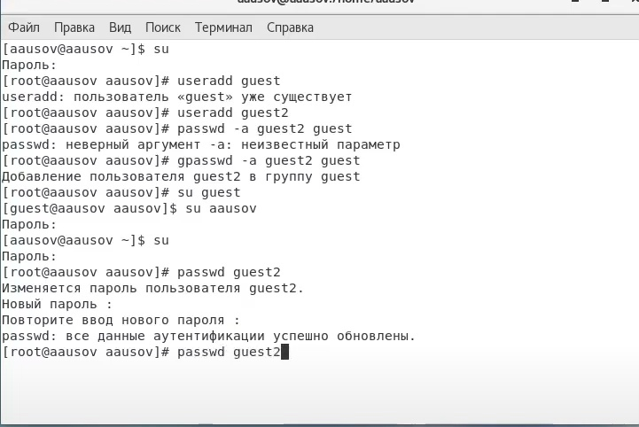
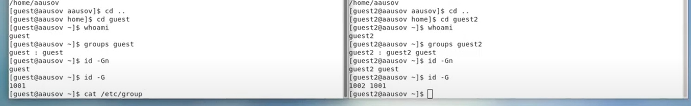
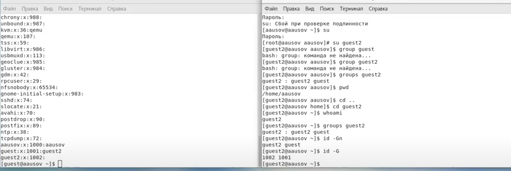
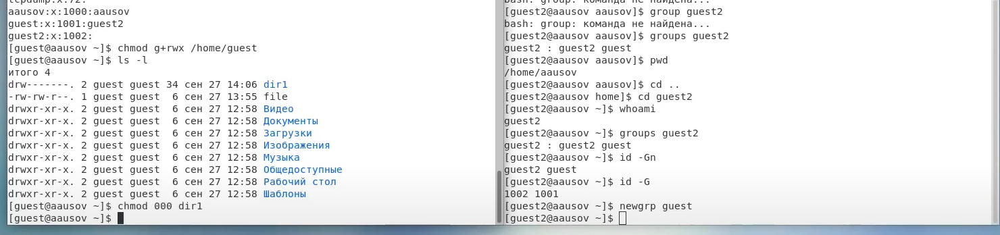

---
# Front matter
title: "Лабораторнаяработа № 3"
subtitle: "Дискреционное разграничение прав в Linux. Два пользователя"
author: "Алескеров Тимур Магомедович НБибд-01-18"

# Generic otions
lang: ru-RU
toc-title: "Содержание"

# Bibliography
bibliography: bib/cite.bib
csl: pandoc/csl/gost-r-7-0-5-2008-numeric.csl

# Pdf output format
toc: true # Table of contents
toc_depth: 2
lof: true # List of figures
lot: true # List of tables
fontsize: 12pt
linestretch: 1.5
papersize: a4
documentclass: scrreprt
## I18n
polyglossia-lang:
  name: russian
  options:
	- spelling=modern
	- babelshorthands=true
polyglossia-otherlangs:
  name: english
### Fonts
mainfont: PT Serif
romanfont: PT Serif
sansfont: PT Sans
monofont: PT Mono
mainfontoptions: Ligatures=TeX
romanfontoptions: Ligatures=TeX
sansfontoptions: Ligatures=TeX,Scale=MatchLowercase
monofontoptions: Scale=MatchLowercase,Scale=0.9
## Biblatex
biblatex: true
biblio-style: "gost-numeric"
biblatexoptions:
  - parentracker=true
  - backend=biber
  - hyperref=auto
  - language=auto
  - autolang=other*
  - citestyle=gost-numeric
## Misc options
indent: true
header-includes:
  - \linepenalty=10 # the penalty added to the badness of each line within a paragraph (no associated penalty node) Increasing the value makes tex try to have fewer lines in the paragraph.
  - \interlinepenalty=0 # value of the penalty (node) added after each line of a paragraph.
  - \hyphenpenalty=50 # the penalty for line breaking at an automatically inserted hyphen
  - \exhyphenpenalty=50 # the penalty for line breaking at an explicit hyphen
  - \binoppenalty=070 # the penalty for breaking a line at a binary operator
  - \relpenalty=050 # the penalty for breaking a line at a relation
  - \clubpenalty=150 # extra penalty for breaking after first line of a paragraph
  - \widowpenalty=150 # extra penalty for breaking before last line of a paragraph
  - \displaywidowpenalty=50 # extra penalty for breaking before last line before a display math
  - \brokenpenalty=010 # extra penalty for page breaking after a hyphenated line
  - \predisplaypenalty=10000 # penalty for breaking before a display
  - \postdisplaypenalty=0 # penalty for breaking after a display
  - \floatingpenalty = 20000 # penalty for splitting an insertion (can only be split footnote in standard LaTeX)
  - \raggedbottom # or \flushbottom
  - \usepackage{float} # keep figures where there are in the text
  - \floatplacement{figure}{H} # keep figures where there are in the text
  - \usepackage{rotating}
  - \usepackage{tabularx}
---

# Цель работы

Получение практических навыков работы в консоли с атрибутами файлов для групп пользователей

# Задание

1. Добавить пользователя guest2
2. Создать пароль для пользователя guest2
3. Добавить guest2 в группу guest
4. Опытным путём заполнить таблицу "Установленные права и разрешённые действия"
5. На основании заполненной таблицы определить те или иные минимально необходимые права для выполнения операций внутри директории

# Теоретическое введение

В операционной системе Linux есть много отличных функций безопасности, но она из самых важных - это система прав доступа к файлам. Linux, как последователь идеологии ядра Linux в отличие от Windows, изначально проектировался как многопользовательская система, поэтому права доступа к файлам в linux продуманы очень хорошо.

И это очень важно, потому что локальный доступ к файлам для всех программ и всех пользователей позволил бы вирусам без проблем уничтожить систему. Но новым пользователям могут показаться очень сложными новые права на файлы в linux, которые очень сильно отличаются от того, что мы привыкли видеть в Windows. В этой статье мы попытаемся разобраться в том как работают права файлов в linux, а также как их изменять и устанавливать.

Изначально каждый файл имел три параметра доступа. Вот они:

Чтение - разрешает получать содержимое файла, но на запись нет. Для каталога позволяет получить список файлов и каталогов, расположенных в нем;

Запись - разрешает записывать новые данные в файл или изменять существующие, а также позволяет создавать и изменять файлы и каталоги;

Выполнение - вы не можете выполнить программу, если у нее нет флага выполнения. Этот атрибут устанавливается для всех программ и скриптов, именно с помощью него система может понять, что этот файл нужно запускать как программу.

Но все эти права были бы бессмысленными, если бы применялись сразу для всех пользователей. Поэтому каждый файл имеет три категории пользователей, для которых можно устанавливать различные сочетания прав доступа:

Владелец - набор прав для владельца файла, пользователя, который его создал или сейчас установлен его владельцем. Обычно владелец имеет все права, чтение, запись и выполнение.
Группа - любая группа пользователей, существующая в системе и привязанная к файлу. Но это может быть только одна группа и обычно это группа владельца, хотя для файла можно назначить и другую группу.
Остальные - все пользователи, кроме владельца и пользователей, входящих в группу файла.
Именно с помощью этих наборов полномочий устанавливаются права файлов в linux. Каждый пользователь может получить полный доступ только к файлам, владельцем которых он является или к тем, доступ к которым ему разрешен. Только пользователь Root может работать со всеми файлами независимо от их набора их полномочий.

Но со временем такой системы стало не хватать и было добавлено еще несколько флагов, которые позволяют делать файлы не изменяемыми или же выполнять от имени суперпользователя

Более подробно о правах см. в [@lossit:linux].

# Выполнение лабораторной работы

1. В установленной операционной системе создайте учётную запись пользователя guest (использую учётную запись администратора)
Задал пароль для пользователя guest (использую учётную запись администратора) (рис. [-@fig:002]):
passwd guest (рис. [-@fig:001]):
useradd guest

{ #fig:001 width=70% }

2. Осуществите вход в систему от двух пользователей на двух разных консолях: guest на первой консоли и guest2 на второй консоли.
 (рис. [-@fig:002]).

{ #fig:002 width=70% }

3. Для обоих пользователей командой pwd определите директорию, в которой вы находитесь. Сравните её с приглашениями командной строки. (рис. [-@fig:002]). 

4. Уточните имя вашего пользователя, его группу, кто входит в неё
и к каким группам принадлежит он сам. Определите командами
groups guest и groups guest2, в какие группы входят пользователи guest и guest2. Сравните вывод команды groups с выводом команд
id -Gn и id -G. (рис. [-@fig:004]).

{ #fig:004 width=70% }

5. Сравните полученную информацию с содержимым файла /etc/group.
Просмотрите файл командой
cat /etc/group (рис. [-@fig:005]) и (рис. [-@fig:006])

{ #fig:005 width=70% }

{ #fig:006 width=70% }

6. От имени пользователя guest2 выполните регистрацию пользователя
guest2 в группе guest командой
newgrp guest
 (рис. [-@fig:007])

{ #fig:007 width=70% }

8. От имени пользователя guest измените права директории /home/guest,
разрешив все действия для пользователей группы:
chmod g+rwx /home/guest (рис. [-@fig:008])

{ #fig:008 width=70% }

10. От имени пользователя guest снимите с директории /home/guest/dir1
все атрибуты командой
chmod 000 dirl (рис. [-@fig:008])
и проверьте правильность снятия атрибутов.
Меняя атрибуты у директории dir1 и файла file1 от имени пользователя guest и делая проверку от пользователя guest2, заполнил [-@tbl:avoid]
На основании заполненной таблицы определил те или иные минимально необходимые права для выполнения операций внутри директории [-@tbl:min]
dir1

: Установленные права и разрешённые действия  {#tbl:avoid}

| Права директо рии | Права файла      | Создание файла | Удаление файла | Запись в файл | Чтение файла | Смена директории | Просмотр файлов в директории | Переименование файла | Смена атрибутов файла |   |   |   |
|-------------------|------------------|----------------|----------------|---------------|--------------|------------------|------------------------------|----------------------|-----------------------|---|---|---|
| d--------(000)    | --------- (000)  | -              | -              | -             | -            | -                | -                            | -                    | -                     |   |   |   |
|                   |                  |                |                |               |              |                  |                              |                      |                       |   |   |   |
| d-----x--(010)    | --------- (000)  | -              | -              | -             | -            | +                | -                            | -                    | +                     |   |   |   |
|                   |                  |                |                |               |              |                  |                              |                      |                       |   |   |   |
| d----w---(020)    | --------- (000)  | -              | -              | -             | -            | -                | -                            | -                    | -                     |   |   |   |
|                   |                  |                |                |               |              |                  |                              |                      |                       |   |   |   |
| d----wx--(030)    | --------- (000)  | +              | +              | -             | -            | +                | -                            | +                    | +                     |   |   |   |
|                   |                  |                |                |               |              |                  |                              |                      |                       |   |   |   |
| d---r----(040)    | --------- (000)  | -              | -              | -             | -            | -                | +                            | -                    | -                     |   |   |   |
|                   |                  |                |                |               |              |                  |                              |                      |                       |   |   |   |
| d---r-x--(050)    | --------- (000)  | -              | -              | -             | -            | +                | +                            | -                    | +                     |   |   |   |
|                   |                  |                |                |               |              |                  |                              |                      |                       |   |   |   |
| d---rw---(060)    | --------- (000)  | -              | -              | -             | -            | -                | +                            | -                    | -                     |   |   |   |
|                   |                  |                |                |               |              |                  |                              |                      |                       |   |   |   |
| d---rwx--(070)    | --------- (000)  | +              | +              | -             | -            | +                | +                            | +                    | +                     |   |   |   |
|                   |                  |                |                |               |              |                  |                              |                      |                       |   |   |   |
| d--------(000)    | -----x--- (010)  | -              | -              | -             | -            | -                | -                            | -                    | -                     |   |   |   |
|                   |                  |                |                |               |              |                  |                              |                      |                       |   |   |   |
| d-----x--(010)    | -----x--- (010)  | -              | -              | -             | -            | +                | -                            | -                    | +                     |   |   |   |
|                   |                  |                |                |               |              |                  |                              |                      |                       |   |   |   |
| d----w---(020)    | -----x--- (010)  | -              | -              | -             | -            | -                | -                            | -                    | -                     |   |   |   |
|                   |                  |                |                |               |              |                  |                              |                      |                       |   |   |   |
| d----wx--(030)    | -----x--- (010)  | +              | +              | -             | -            | +                | -                            | +                    | +                     |   |   |   |
|                   |                  |                |                |               |              |                  |                              |                      |                       |   |   |   |
| d---r----(040)    | -----x--- (010)  | -              | -              | -             | -            | -                | +                            | -                    | -                     |   |   |   |
|                   |                  |                |                |               |              |                  |                              |                      |                       |   |   |   |
| d---r-x--(050)    | -----x--- (010)  | -              | -              | -             | -            | +                | +                            | -                    | +                     |   |   |   |
|                   |                  |                |                |               |              |                  |                              |                      |                       |   |   |   |
| d---rw---(050)    | -----x--- (010)  | -              | -              | -             | -            | -                | +                            | -                    | -                     |   |   |   |
|                   |                  |                |                |               |              |                  |                              |                      |                       |   |   |   |
| d---rwx--(050)    | -----x--- (010)  | +              | +              | -             | -            | +                | +                            | +                    | +                     |   |   |   |
|                   |                  |                |                |               |              |                  |                              |                      |                       |   |   |   |
| d--------(000)    | ----w---- (020)  | -              | -              | -             | -            | -                | -                            | -                    | -                     |   |   |   |
|                   |                  |                |                |               |              |                  |                              |                      |                       |   |   |   |
| d-----x--(010)    | ----w---- (020)  | -              | -              | +             | -            | +                | -                            | -                    | +                     |   |   |   |
|                   |                  |                |                |               |              |                  |                              |                      |                       |   |   |   |
| d----w---(020)    | ----w---- (020)  | -              | -              | -             | -            | -                | -                            | -                    | -                     |   |   |   |
|                   |                  |                |                |               |              |                  |                              |                      |                       |   |   |   |
| d----wx--(030)    | ----w---- (020)  | +              | +              | +             | -            | +                | -                            | +                    | +                     |   |   |   |
|                   |                  |                |                |               |              |                  |                              |                      |                       |   |   |   |
| d---r----(040)    | ----w---- (020)  | -              | -              | -             | -            | -                | +                            | -                    | -                     |   |   |   |
|                   |                  |                |                |               |              |                  |                              |                      |                       |   |   |   |
| d---r-x--(050)    | ----w---- (020)  | -              | -              | +             | -            | +                | +                            | -                    | +                     |   |   |   |
|                   |                  |                |                |               |              |                  |                              |                      |                       |   |   |   |
| d---rw---(060)    | ----w---- (020)  | -              | -              | -             | -            | -                | +                            | -                    | -                     |   |   |   |
|                   |                  |                |                |               |              |                  |                              |                      |                       |   |   |   |
| d---rwx--(070)    | ----w---- (020)  | +              | +              | +             | -            | +                | +                            | +                    | +                     |   |   |   |
|                   |                  |                |                |               |              |                  |                              |                      |                       |   |   |   |
| d--------(000)    | ----wx--- (030)  | -              | -              | -             | -            | -                | -                            | -                    | -                     |   |   |   |
|                   |                  |                |                |               |              |                  |                              |                      |                       |   |   |   |
| d-----x--(010)    | ----wx--- (030)  | -              | -              | +             | -            | +                | -                            | -                    | +                     |   |   |   |
|                   |                  |                |                |               |              |                  |                              |                      |                       |   |   |   |
| d----w---(020)    | ----wx--- (030)  | -              | -              | -             | -            |                  | -                            | -                    | -                     |   |   |   |
|                   |                  |                |                |               |              |                  |                              |                      |                       |   |   |   |
| d----wx--(030)    | ----wx--- (030)  | +              | +              | +             | -            | +                | -                            | +                    | +                     |   |   |   |
|                   |                  |                |                |               |              |                  |                              |                      |                       |   |   |   |
| d---r----(040)    | ----wx--- (030)  | -              | -              | -             | -            | -                | +                            | -                    | -                     |   |   |   |
|                   |                  |                |                |               |              |                  |                              |                      |                       |   |   |   |
| d---r-x--(050)    | ----wx--- (030)  | -              | -              | +             | -            | +                | +                            | -                    | +                     |   |   |   |
|                   |                  |                |                |               |              |                  |                              |                      |                       |   |   |   |
| d---rw---(050)    | ----wx--- (030)  | -              | -              | -             | -            | -                | +                            | -                    | -                     |   |   |   |
|                   |                  |                |                |               |              |                  |                              |                      |                       |   |   |   |
| d---rwx--(050)    | ----wx--- (030)  | +              | +              | +             | -            | +                | +                            | +                    | +                     |   |   |   |
|                   |                  |                |                |               |              |                  |                              |                      |                       |   |   |   |
| d--------(000)    | ---r----- (030)  | -              | -              | -             | -            | -                | -                            | -                    | -                     |   |   |   |
|                   |                  |                |                |               |              |                  |                              |                      |                       |   |   |   |
| d-----x--(010)    | ---r----- (030)  | -              | -              | -             | +            | +                | -                            | -                    | +                     |   |   |   |
|                   |                  |                |                |               |              |                  |                              |                      |                       |   |   |   |
| d----w---(020)    | ---r----- (030)  | -              | -              | -             | -            | -                | -                            | -                    | -                     |   |   |   |
|                   |                  |                |                |               |              |                  |                              |                      |                       |   |   |   |
| d----wx--(030)    | ---r----- (030)  | +              | +              | -             | +            | +                | -                            | +                    | +                     |   |   |   |
|                   |                  |                |                |               |              |                  |                              |                      |                       |   |   |   |
| d---r----(040)    | ---r----- (030)  | -              | -              | -             | -            | -                | +                            | -                    | -                     |   |   |   |
|                   |                  |                |                |               |              |                  |                              |                      |                       |   |   |   |
| d---r-x--(050)    | ---r----- (030)  | -              | -              | -             | +            | +                | +                            | -                    | +                     |   |   |   |
|                   |                  |                |                |               |              |                  |                              |                      |                       |   |   |   |
| d---rw---(050)    | ---r----- (030)  | -              | -              | -             | -            | -                | +                            | -                    | -                     |   |   |   |
|                   |                  |                |                |               |              |                  |                              |                      |                       |   |   |   |
| d---rwx--(050)    | ---r----- (030)  | +              | +              | -             | +            | +                | +                            | +                    | +                     |   |   |   |
|                   |                  |                |                |               |              |                  |                              |                      |                       |   |   |   |
| d--------(000)    | ---r-x--- (050)  | -              | -              | -             | -            | -                | -                            | -                    | -                     |   |   |   |
|                   |                  |                |                |               |              |                  |                              |                      |                       |   |   |   |
| d-----x--(010)    | ---r-x--- (050)  | -              | -              | -             | +            | +                | -                            | -                    | +                     |   |   |   |
|                   |                  |                |                |               |              |                  |                              |                      |                       |   |   |   |
| d----w---(020)    | ---r-x--- (050)  | -              | -              | -             | -            | -                | -                            | -                    | -                     |   |   |   |
|                   |                  |                |                |               |              |                  |                              |                      |                       |   |   |   |
| d----wx--(030)    | ---r-x--- (050)  | +              | +              | -             | +            | +                | -                            | +                    | +                     |   |   |   |
|                   |                  |                |                |               |              |                  |                              |                      |                       |   |   |   |
| d---r----(040)    | ---r-x--- (050)  | -              | -              | -             | -            | -                | +                            | -                    | -                     |   |   |   |
|                   |                  |                |                |               |              |                  |                              |                      |                       |   |   |   |
| d---r-x--(050)    | ---r-x--- (050)  | -              | -              | -             | +            | +                | +                            | -                    | +                     |   |   |   |
|                   |                  |                |                |               |              |                  |                              |                      |                       |   |   |   |
| d---rw---(050)    | ---r-x--- (050)  | -              | -              | -             | -            | -                | +                            | -                    | -                     |   |   |   |
|                   |                  |                |                |               |              |                  |                              |                      |                       |   |   |   |
| d---rwx--(050)    | ---r-x--- (050)  | +              | +              | -             | +            | +                | +                            | +                    | +                     |   |   |   |
|                   |                  |                |                |               |              |                  |                              |                      |                       |   |   |   |
| d--------(000)    | ---rw---- (060)  | -              | -              | -             | -            | -                | -                            | -                    | -                     |   |   |   |
|                   |                  |                |                |               |              |                  |                              |                      |                       |   |   |   |
| d-----x--(010)    | ---rw---- (060)  | -              | -              | +             | +            | +                | -                            | -                    | +                     |   |   |   |
|                   |                  |                |                |               |              |                  |                              |                      |                       |   |   |   |
| d----w---(020)    | ---rw---- (060)  | -              | -              | -             | -            | -                | -                            | -                    | -                     |   |   |   |
|                   |                  |                |                |               |              |                  |                              |                      |                       |   |   |   |
| d----wx--(030)    | ---rw---- (060)  | +              | +              | +             | +            | +                | -                            | +                    | +                     |   |   |   |
|                   |                  |                |                |               |              |                  |                              |                      |                       |   |   |   |
| d---r----(040)    | ---rw---- (060)  | -              | -              | -             | -            | -                | +                            | -                    | -                     |   |   |   |
|                   |                  |                |                |               |              |                  |                              |                      |                       |   |   |   |
| d---r-x--(050)    | ---rw---- (060)  | -              | -              | +             | +            | +                | +                            | -                    | +                     |   |   |   |
|                   |                  |                |                |               |              |                  |                              |                      |                       |   |   |   |
| d---rw---(050)    | ---rw---- (060)  | -              | -              | -             | -            | -                | +                            | -                    | -                     |   |   |   |
|                   |                  |                |                |               |              |                  |                              |                      |                       |   |   |   |
| d---rwx--(050)    | ---rw---- (060)  | +              | +              | +             | +            | +                | +                            | +                    | +                     |   |   |   |
|                   |                  |                |                |               |              |                  |                              |                      |                       |   |   |   |
| d--------(000)    | ---rwx--- (070)  | -              | -              | -             | -            | -                | -                            | -                    | -                     |   |   |   |
|                   |                  |                |                |               |              |                  |                              |                      |                       |   |   |   |
| d-----x--(010)    | ---rwx--- (070)  | -              | -              | +             | +            | +                | -                            | -                    | +                     |   |   |   |
|                   |                  |                |                |               |              |                  |                              |                      |                       |   |   |   |
| d----w---(020)    | ---rwx--- (070)  | -              | -              | -             | -            | -                | -                            | -                    | -                     |   |   |   |
|                   |                  |                |                |               |              |                  |                              |                      |                       |   |   |   |
| d----wx--(030)    | ---rwx--- (070)  | +              | +              | +             | +            | +                | -                            | +                    | +                     |   |   |   |
|                   |                  |                |                |               |              |                  |                              |                      |                       |   |   |   |
| d---r----(040)    | ---rwx--- (070)  | -              | -              | -             | -            | -                | +                            | -                    | -                     |   |   |   |
|                   |                  |                |                |               |              |                  |                              |                      |                       |   |   |   |
| d---r-x--(050)    | ---rwx--- (070)  | -              | -              | +             | +            | +                | +                            | -                    | +                     |   |   |   |
|                   |                  |                |                |               |              |                  |                              |                      |                       |   |   |   |
| d---rw---(050)    | ---rwx--- (070)  | -              | -              | -             | -            | -                | +                            | -                    | -                     |   |   |   |
|                   |                  |                |                |               |              |                  |                              |                      |                       |   |   |   |
| d---rwx--(050)    | ---rwx--- (070)  | +              | +              | +             | +            | +                | +                            | +                    | +                     |   |   |   |
|                   |                  |                |                |               |              |                  |                              |                      |                       |   |   |   |

: Минимально необходимые права для выполнения операций  {#tbl:min}

| Операция               | Минимальные права на директорию | Минимальные права на файл |
|------------------------|---------------------------------|---------------------------|
| Создание файла.        | d----wx--- (030)                | ----------(000)           |
| Удаление файла         | d----wx--- (030)                | ----------(000)           |
| Чтение файла           | d-----x--- (010)                | ---r----- (040)           |
| Запись в файл          | d-----x--- (010)                | ----w---- (020)           |
| Переименование файла   | d----wx--- (030)                | ----------(000)           |
| Создание поддиректории | d----wx--- (030)                | ----------(000)           |
| Удаление поддиректории | d----wx--- (030)                | ----------(000)           |

# Выводы

Выполняя данную лабораторную работу, я получил практические навыкои работы в консоли с атрибутами файлов для групп пользователей.

# Список литературы{.unnumbered}

::: {#refs}
:::
