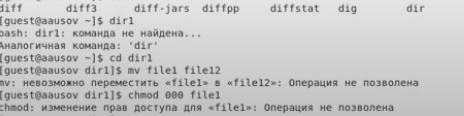
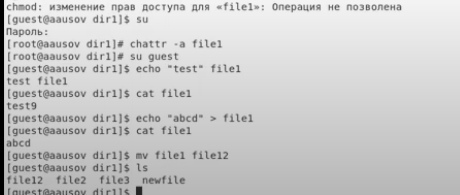
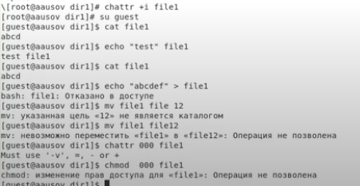

---
## Front matter
lang: ru-RU
title: Лабораторная работа №4
author: |
	Александр Усов
institute: |
	 RUDN University, Moscow, Russian Federation
date: Сентябрь, 2021 Москва

## Formatting
toc: false
slide_level: 2
theme: metropolis
sansfont: NotoMono-Regular
header-includes: 
 - \metroset{progressbar=frametitle,sectionpage=progressbar,numbering=fraction}
 - '\makeatletter'
 - '\beamer@ignorenonframefalse'
 - '\makeatother'
aspectratio: 43
section-titles: true
---

# Прагматика выполнения лабораторной работы

Предположим вы хотите защитить некоторые важные файлы в Linux. При чем они должны быть защищены не только от перезаписи 
но и от случайного или преднамеренного удаления и перемещения. Предотвратить перезапись или изменение битов доступа к файлов 
можно с помощью стандартных утилит chmod и chown, но это не идеальное решение, так как у суперпользователя по прежнему остается полный доступ. 
Но есть еще одно решение. Это команда chattr.
Эта утилита позволяет устанавливать и отключать атрибуты файлов, на уровне файловой системы не зависимо от стандартных (чтение, запись, выполнение). 

# Цель работы

## Цель работы

Получение практических навыков работы в консоли с расширенными атрибутами файлов

# Задачи

## Задачи

1. Создать файл file1
2. Установить расширенный атрибут a на файл и попробовать применить некоторые команды
3. Снять расширенный атрибут a с файла и попробовать применить команды без него
4. Установить атрибут i на файл и попробовать команды на нем.

# Результат

## Результат атрибут a

{ #fig:008 width=30% }

{ #fig:010 width=30% }

## Результат без атрибута

{ #fig:011 width=70% }

## Результат атрибут i

{ #fig:012 width=70% }

## Вывод

В результате выполнения работы вы повысили свои навыки использования интерфейса командой строки (CLI), познакомились на примерах с тем,
как используются основные и расширенные атрибуты при разграничении
доступа. Имели возможность связать теорию дискреционного разделения
доступа (дискреционная политика безопасности) с её реализацией на практике в ОС Linux. Опробовали действие на практике расширенных атрибутов «а» и «i».

## {.standout}

Спасибо за внимание!
