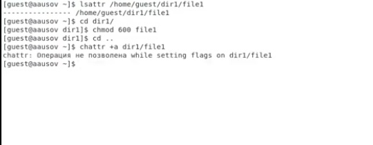
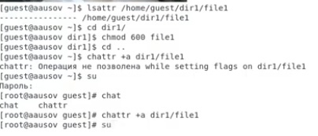
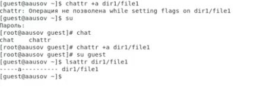
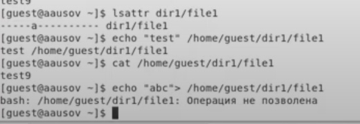
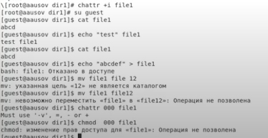

---
# Front matter
title: "Лабораторнаяработа № 4"
subtitle: "Дискреционное разграничение прав в Linux. Расширенные атрибуты"
author: "Усов Александр Александрович НБибд-02-18"

# Generic otions
lang: ru-RU
toc-title: "Содержание"

# Bibliography
bibliography: bib/cite.bib
csl: pandoc/csl/gost-r-7-0-5-2008-numeric.csl

# Pdf output format
toc: true # Table of contents
toc_depth: 2
lof: true # List of figures
lot: true # List of tables
fontsize: 12pt
linestretch: 1.5
papersize: a4
documentclass: scrreprt
## I18n
polyglossia-lang:
  name: russian
  options:
	- spelling=modern
	- babelshorthands=true
polyglossia-otherlangs:
  name: english
### Fonts
mainfont: PT Serif
romanfont: PT Serif
sansfont: PT Sans
monofont: PT Mono
mainfontoptions: Ligatures=TeX
romanfontoptions: Ligatures=TeX
sansfontoptions: Ligatures=TeX,Scale=MatchLowercase
monofontoptions: Scale=MatchLowercase,Scale=0.9
## Biblatex
biblatex: true
biblio-style: "gost-numeric"
biblatexoptions:
  - parentracker=true
  - backend=biber
  - hyperref=auto
  - language=auto
  - autolang=other*
  - citestyle=gost-numeric
## Misc options
indent: true
header-includes:
  - \linepenalty=10 # the penalty added to the badness of each line within a paragraph (no associated penalty node) Increasing the value makes tex try to have fewer lines in the paragraph.
  - \interlinepenalty=0 # value of the penalty (node) added after each line of a paragraph.
  - \hyphenpenalty=50 # the penalty for line breaking at an automatically inserted hyphen
  - \exhyphenpenalty=50 # the penalty for line breaking at an explicit hyphen
  - \binoppenalty=070 # the penalty for breaking a line at a binary operator
  - \relpenalty=050 # the penalty for breaking a line at a relation
  - \clubpenalty=150 # extra penalty for breaking after first line of a paragraph
  - \widowpenalty=150 # extra penalty for breaking before last line of a paragraph
  - \displaywidowpenalty=50 # extra penalty for breaking before last line before a display math
  - \brokenpenalty=010 # extra penalty for page breaking after a hyphenated line
  - \predisplaypenalty=10000 # penalty for breaking before a display
  - \postdisplaypenalty=0 # penalty for breaking after a display
  - \floatingpenalty = 20000 # penalty for splitting an insertion (can only be split footnote in standard LaTeX)
  - \raggedbottom # or \flushbottom
  - \usepackage{float} # keep figures where there are in the text
  - \floatplacement{figure}{H} # keep figures where there are in the text
  - \usepackage{rotating}
  - \usepackage{tabularx}
---

# Цель работы

Получение практических навыков работы в консоли с расширенными атрибутами файлов

# Задание

1. Создать файл file1
2. Установить расширенный атрибут a на файл и попробовать применить некоторые команды
3. Снять расширенный атрибут a с файла и попробовать применить команды без него
4. Установить атрибут i на файл и попробовать команды на нем.

# Теоретическое введение

Предположим вы хотите защитить некоторые важные файлы в Linux. При чем они должны быть защищены не только от перезаписи 
но и от случайного или преднамеренного удаления и перемещения. Предотвратить перезапись или изменение битов доступа к файлов 
можно с помощью стандартных утилит chmod и chown, но это не идеальное решение, так как у суперпользователя по прежнему остается полный доступ. 
Но есть еще одно решение. Это команда chattr.
Эта утилита позволяет устанавливать и отключать атрибуты файлов, на уровне файловой системы не зависимо от стандартных (чтение, запись, выполнение). 
Для просмотра текущих аттрибутов можно использовать lsattr. Изначально атрибуты управляемые chattr и lsattr поддерживались только файловыми 
системами семейства ext (ext2,ext3,ext4). но теперь эта возможность доступна и в других популярных файловых системах таких как XFS, Btrfs, ReiserFS, 
и т д.

Более подробно см. в [@lossit:linux].

# Выполнение лабораторной работы

1. От имени пользователя guest определили расширенные атрибуты файла /home/guest/dir1/file1 командой lsattr /home/guest/dir1/file1 
 (рис. [-@fig:001]):

{ #fig:001 width=70% }

2. Установили командой chmod 600 file1 на файл file1 права, разрешающие чтение и запись для владельца файла. 
 (рис. [-@fig:002]).

{ #fig:002 width=70% }

3. Попробовали установить на файл /home/guest/dir1/file1 расширенный атрибут a от имени пользователя guest: chattr +a /home/guest/dir1/file1. 
 (рис. [-@fig:003]). 

{ #fig:003 width=70% }

4. Повысили свои права с помощью команды su. Установили расширенный атрибут a на файл /home/guest/dir1/file1 
от имени суперпользователя: chattr +a /home/guest/dir1/file1  (рис. [-@fig:004]).

{ #fig:004 width=70% }

5. От пользователя guest проверили правильность установления атрибута: lsattr /home/guest/dir1/file1  
  (рис. [-@fig:005])

{ #fig:005 width=70% }

6. Выполнили дозапись в файл file1 слова «test» командой: echo "test" /home/guest/dir1/file1.
 (рис. [-@fig:007])

{ #fig:007 width=70% }

Далее выполнили чтение файла file1 командой cat /home/guest/dir1/file1. Убедились, что слово test было успешно записано в file1 (рис. [-@fig:008])

7. Попробовали перезаписать текст в файле file1 командой echo "abcd">/home/guest/dirl/file1. (рис. [-@fig:008])

{ #fig:008 width=70% }

Попробовали переименовать файл. Но в каждом случае получили отказ. (рис. [-@fig:009])

{ #fig:009 width=70% }

8. Попробовали с помощью команды chmod 000 file1 установить на файл file1 права, 
запрещающие чтение и запись для владельца файла. Нам не удалось это сделать. (рис. [-@fig:010])

{ #fig:010 width=70% }

9. Сняли расширенный атрибут a с файла /home/guest/dirl/file1 от имени суперпользователя командой chattr -a /home/guest/dir1/file1. 
Повторили операции, которые нам ранее не удавалось выполнить. Ваши наблюдения занесите в отчёт. (рис. [-@fig:011])

{ #fig:011 width=70% }

10. Повторили действия по шагам, заменив атрибут «a» (только добавление к файлу) атрибутом «i» (неизменяемый). (рис. [-@fig:012])

{ #fig:012 width=70% }

# Выводы

В результате выполнения работы вы повысили свои навыки использования интерфейса командой строки (CLI), познакомились на примерах с тем,
как используются основные и расширенные атрибуты при разграничении
доступа. Имели возможность связать теорию дискреционного разделения
доступа (дискреционная политика безопасности) с её реализацией на практике в ОС Linux. Опробовали действие на практике расширенных атрибутов «а» и «i».

# Список литературы{.unnumbered}

::: {#refs}
:::
