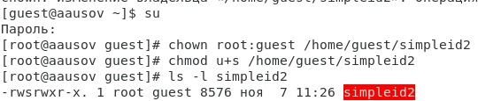

---
## Front matter
lang: ru-RU
title: Лабораторная работа №5
author: |
	Александр Усов
institute: |
	 RUDN University, Moscow, Russian Federation
date: Сентябрь, 2021 Москва

## Formatting
toc: false
slide_level: 2
theme: metropolis
sansfont: NotoMono-Regular
header-includes: 
 - \metroset{progressbar=frametitle,sectionpage=progressbar,numbering=fraction}
 - '\makeatletter'
 - '\beamer@ignorenonframefalse'
 - '\makeatother'
aspectratio: 43
section-titles: true
---

# Прагматика выполнения лабораторной работы

setuid и setgid являются флагами прав доступа в Unix, которые разрешают пользователям запускать исполняемые файлы с правами владельца или группы 
исполняемого файла. В Unix-подобных системах приложение запускается с правами пользователя, вызвавшего указанное приложение. 
Это обеспечивает дополнительную безопасность, так как процесс с правами пользователя не сможет получить доступ на запись к важным системным файлам, 
например /etc/passwd, который принадлежит суперпользователю root.

Sticky bit — дополнительный атрибут файлов или каталогов в операционных системах семейства UNIX. Впервые sticky bit появился в пятой редакции 
UNIX в 1974 году для использования в исполняемых файлах. Он применялся для уменьшения времени загрузки наиболее часто используемых программ. 
После закрытия программы код и данные оставались в памяти, а следующий запуск происходил быстрее

# Цель работы

## Цель работы

Изучение механизмов изменения идентификаторов, применения
SetUID- и Sticky-битов. Получение практических навыков работы в консоли с дополнительными атрибутами. Рассмотрение работы механизма
смены идентификатора процессов пользователей, а также влияние бита
Sticky на запись и удаление файлов.

# Задачи

## Задачи

1. Создать и проверить работу файла simpleid.c
2. Расширить работу файла simpleid2.c и проверить работу с разными атрибутами
3. Создать программу  readfile.c и проверить атрибуты на нем.

# Результат

## Опробовали новые атрибуты

{ #fig:006 width=70% }

## Исследовали Sticky-бит

{ #fig:014 width=70% }

## Вывод

В результате выполнения работы я изучил механизмы изменения идентификаторов, применения SetUID- и Sticky-битов. Получил практические навыки работы в консоли с дополнительными атрибутами. Также я рассмотрел работы механизма смены идентификатора процессов пользователей и влияние бита Sticky на запись и удаление файлов.

## {.standout}

Спасибо за внимание!
