---
# Front matter
title: "Лабораторнаяработа № 5"
subtitle: "Дискреционное разграничение прав в Linux. Исследование влияния дополнительных атрибутов"
author: "Алескеров Тимур НБибд-01-18"

# Generic otions
lang: ru-RU
toc-title: "Содержание"

# Bibliography
bibliography: bib/cite.bib
csl: pandoc/csl/gost-r-7-0-5-2008-numeric.csl

# Pdf output format
toc: true # Table of contents
toc_depth: 2
lof: true # List of figures
lot: true # List of tables
fontsize: 12pt
linestretch: 1.5
papersize: a4
documentclass: scrreprt
## I18n
polyglossia-lang:
  name: russian
  options:
	- spelling=modern
	- babelshorthands=true
polyglossia-otherlangs:
  name: english
### Fonts
mainfont: PT Serif
romanfont: PT Serif
sansfont: PT Sans
monofont: PT Mono
mainfontoptions: Ligatures=TeX
romanfontoptions: Ligatures=TeX
sansfontoptions: Ligatures=TeX,Scale=MatchLowercase
monofontoptions: Scale=MatchLowercase,Scale=0.9
## Biblatex
biblatex: true
biblio-style: "gost-numeric"
biblatexoptions:
  - parentracker=true
  - backend=biber
  - hyperref=auto
  - language=auto
  - autolang=other*
  - citestyle=gost-numeric
## Misc options
indent: true
header-includes:
  - \linepenalty=10 # the penalty added to the badness of each line within a paragraph (no associated penalty node) Increasing the value makes tex try to have fewer lines in the paragraph.
  - \interlinepenalty=0 # value of the penalty (node) added after each line of a paragraph.
  - \hyphenpenalty=50 # the penalty for line breaking at an automatically inserted hyphen
  - \exhyphenpenalty=50 # the penalty for line breaking at an explicit hyphen
  - \binoppenalty=070 # the penalty for breaking a line at a binary operator
  - \relpenalty=050 # the penalty for breaking a line at a relation
  - \clubpenalty=150 # extra penalty for breaking after first line of a paragraph
  - \widowpenalty=150 # extra penalty for breaking before last line of a paragraph
  - \displaywidowpenalty=50 # extra penalty for breaking before last line before a display math
  - \brokenpenalty=010 # extra penalty for page breaking after a hyphenated line
  - \predisplaypenalty=10000 # penalty for breaking before a display
  - \postdisplaypenalty=0 # penalty for breaking after a display
  - \floatingpenalty = 20000 # penalty for splitting an insertion (can only be split footnote in standard LaTeX)
  - \raggedbottom # or \flushbottom
  - \usepackage{float} # keep figures where there are in the text
  - \floatplacement{figure}{H} # keep figures where there are in the text
  - \usepackage{rotating}
  - \usepackage{tabularx}
---

# Цель работы

Изучение механизмов изменения идентификаторов, применения
SetUID- и Sticky-битов. Получение практических навыков работы в консоли с дополнительными атрибутами. Рассмотрение работы механизма
смены идентификатора процессов пользователей, а также влияние бита
Sticky на запись и удаление файлов.

# Задание

1. Создать и проверить работу файла simpleid.c
2. Расширить работу файла simpleid2.c и проверить работу с разными атрибутами
3. Создать программу  readfile.c и проверить атрибуты на нем.

# Теоретическое введение

setuid и setgid являются флагами прав доступа в Unix, которые разрешают пользователям запускать исполняемые файлы с правами владельца или группы 
исполняемого файла. В Unix-подобных системах приложение запускается с правами пользователя, вызвавшего указанное приложение. 
Это обеспечивает дополнительную безопасность, так как процесс с правами пользователя не сможет получить доступ на запись к важным системным файлам, 
например /etc/passwd, который принадлежит суперпользователю root.

Более подробно см. в [@lossit:wiki].

Sticky bit — дополнительный атрибут файлов или каталогов в операционных системах семейства UNIX. Впервые sticky bit появился в пятой редакции 
UNIX в 1974 году для использования в исполняемых файлах. Он применялся для уменьшения времени загрузки наиболее часто используемых программ. 
После закрытия программы код и данные оставались в памяти, а следующий запуск происходил быстрее

Более подробно см. в [@lossit:wiki2].

# Выполнение лабораторной работы

## Создание программы

1. Вошли в систему от имени пользователя guest.

2. Создали программу simpleid.c. Для этого запустили редактор vi с помощью команды vi simpleid.c:
  
 (рис. [-@fig:001]):

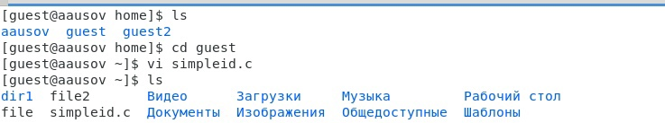{ #fig:001 width=70% }

Напечатали текст программы в открывшемся редакторе:(рис. [-@fig:002]).

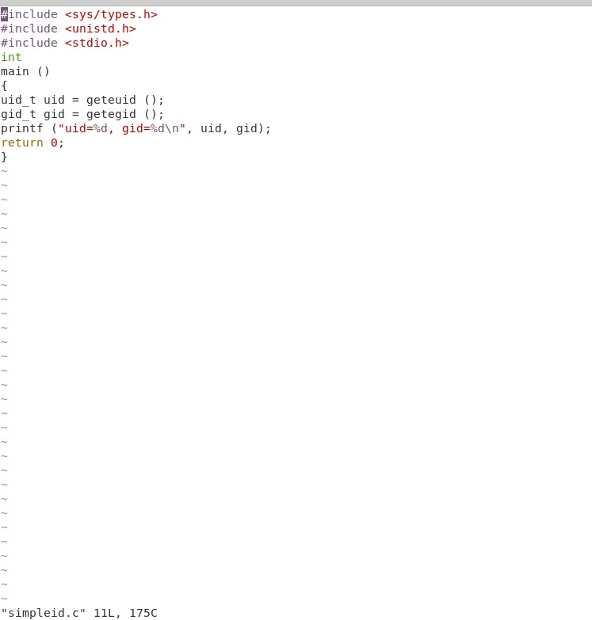{ #fig:002 width=70% }

3. Скомпилировали программу и убедилаись, что файл программы создав:
gcc simpleid.c -o simpleid

 (рис. [-@fig:003]).

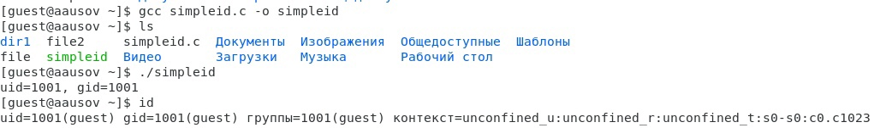{ #fig:003 width=70% }

4. Выполнили программу simpleid командой ./simpleid

 (рис. [-@fig:003]). 

5. Выполнили системную программу id с помощью команды id (рис. [-@fig:003]).
uid и gid совпадает в обеих программах

6. Усложнили программу, добавив вывод действительных идентификаторов. Получившуюся программу назвали simpleid2.c.  (рис. [-@fig:004]).

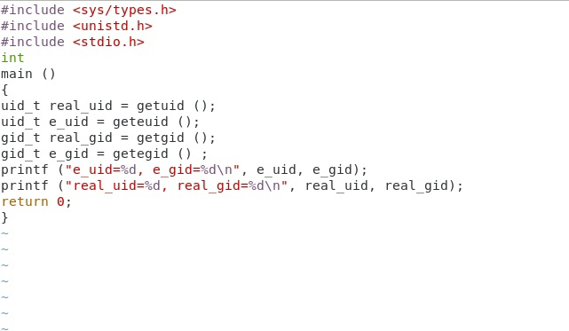{ #fig:004 width=70% }

7. Скомпилировали и запустили simpleid2.c:
gcc simpleid2.c -o simpleid2 ./simpleid2

  (рис. [-@fig:005])

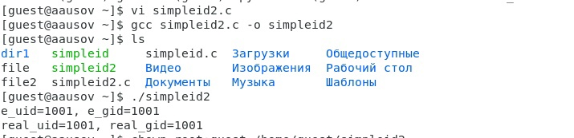{ #fig:005 width=70% }

8. От имени суперпользователя выполнили команды:
chown root:guest /home/guest/simpleid2
chmod u+s /home/guest/simpleid2

 (рис. [-@fig:006])

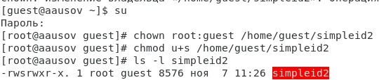{ #fig:006 width=70% }

9. Использовали su для повышения прав до суперпользователя

10. Выполнили проверку правильности установки новых атрибутов и смены владельца файла simpleid2:
ls -l simpleid2 (рис. [-@fig:006])

11. Запустили simpleid2 и id: ./simpleid2,   id
Результат выполнения программ теперь немного отличается (рис. [-@fig:007])

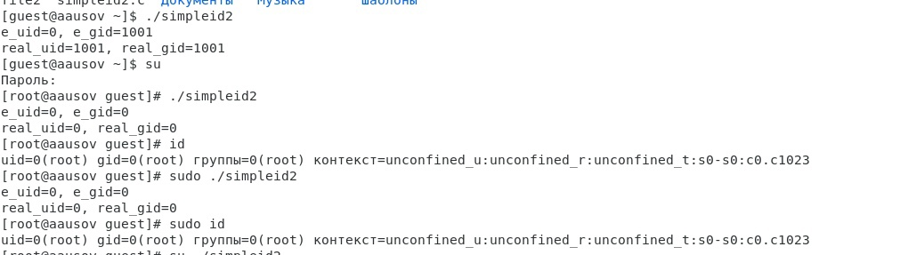{ #fig:007 width=70% }

12. Проделали тоже самое относительно SetGID-бита.
От имени суперпользователя выполним команду chmod g+s /home/guest/simpleid2
 Запустили simpleid2 и id (рис. [-@fig:008])

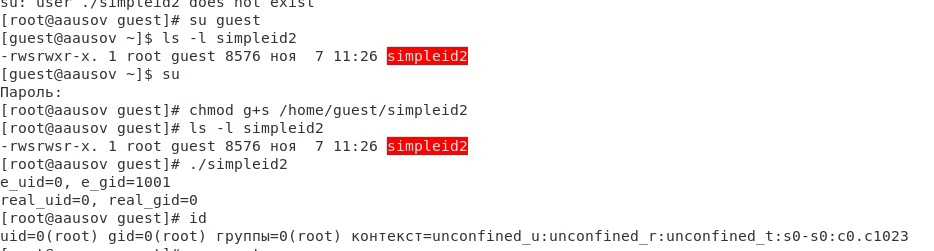{ #fig:008 width=70% }

13. Создали программу readfile.c с помощью команды vi readfile.c
 (рис. [-@fig:009])

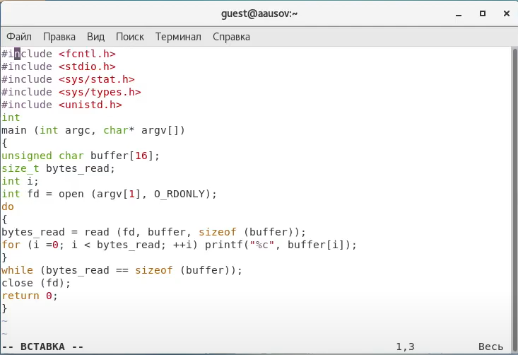{ #fig:009 width=70% }

14. Откомпилировали её. (рис. [-@fig:010])
gcc readfile.c -o readfile

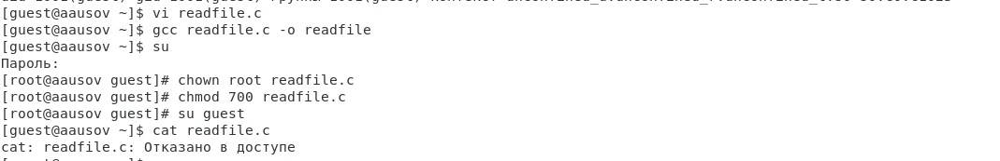{ #fig:010 width=70% }

15. Сменили владельца у файла readfile.c и изменили права так, чтобы только суперпользователь (root) мог прочитать его, a guest не мог.
chown root:guest /home/guest/readfile.c
chmod 700 /home/guest/readfile.c 
(рис. [-@fig:010])

16. Проверили, что пользователь guest не может прочитать файл readfile.c.
(рис. [-@fig:010])

17. Сменили у программы readfile владельца и установили SetU’D-бит. (рис. [-@fig:011])

18. Проверили, может ли программа readfile прочитать файл readfile.c (рис. [-@fig:011])

19. Проверили, может ли программа readfile прочитать файл /etc/shadow (рис. [-@fig:011])

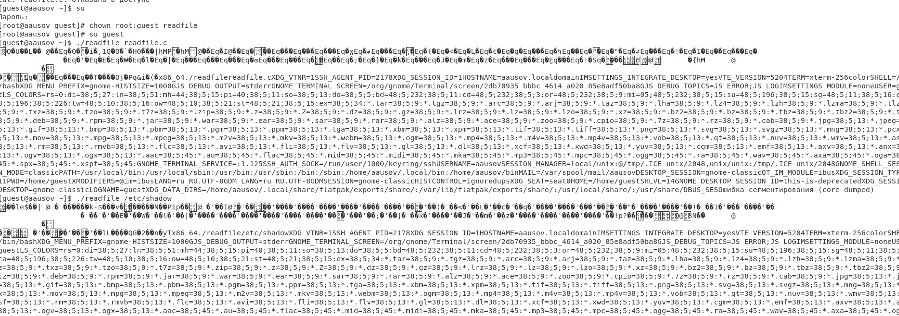{ #fig:011 width=70% }

## Исследование Sticky-бита

20. Выяснили, установлен ли атрибут Sticky на директории /tmp:
ls -l / | grep tmp
 (рис. [-@fig:012])

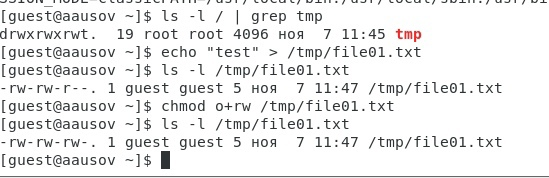{ #fig:012 width=70% }

21. От имени пользователя guest создали файл file01.txt в директории /tmp со словом test:
echo "test" > /tmp/file01.txt (рис. [-@fig:012])

22. Просмотрели атрибуты у только что созданного файла и разрешили чтение и запись для категории пользователей «все остальные»:
ls -l /tmp/file01.txt
chmod o+rw /tmp/file01.txt
ls -l /tmp/file01.txt
(рис. [-@fig:012])
Первоначально все группы имели право на чтение, а запись могли осуществлять все, кроме «остальных пользователей».

23. От пользователя guest2 прочитать файл /tmp/file01.txt:
cat /tmp/file01.txt
(рис. [-@fig:013])

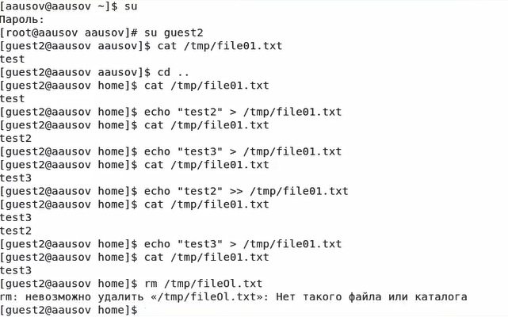{ #fig:013 width=70% }

24. От пользователя guest2 попробовали дозаписать в файл /tmp/file01.txt слово test3 командой:
echo "test2" >> /tmp/file01.txt
(рис. [-@fig:013])

25. Проверили содержимое файла командой:
cat /tmp/file01.txt
(рис. [-@fig:013])

26. От пользователя guest2 попробовали записать в файл /tmp/file01.txt слово test4, стерев при этом всю имеющуюся в файле информацию командой. Для этого воспользовались командой echo "test3" > /tmp/file01.txt
Проверили содержимое файла командой (рис. [-@fig:013])

27. От пользователя guest2 попробовал удалить файл /tmp/file01.txt командой rm /tmp/file01.txt, однако получил отказ.
(рис. [-@fig:013])

28. От суперпользователя командой выполнили команду, снимающую атрибут t (Sticky-бит) с директории /tmp:
chmod -t /tmp (рис. [-@fig:014])

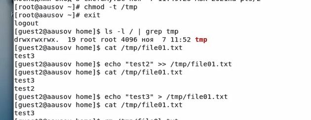{ #fig:014 width=70% }

29. От пользователя guest2 проверили, что атрибута t у директории /tmp нет:
ls -l / | grep tmp (рис. [-@fig:014])

30. Повторили предыдущие шаги. (рис. [-@fig:014])
Получилось удалить файл (рис. [-@fig:015])

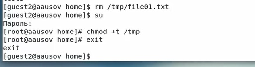{ #fig:015 width=70% }

31. Повысили свои права до суперпользователя и вернули атрибут t на директорию /tmp :
su
chmod +t /tmp
exit
(рис. [-@fig:015])

# Выводы

Изучил механизмы изменения идентификаторов, применения SetUID- и Sticky-битов. Получил практические навыки работы в консоли с дополнительными атрибутами. Также я рассмотрел работы механизма смены идентификатора процессов пользователей и влияние бита Sticky на запись и удаление файлов.

# Список литературы{.unnumbered}

::: {#refs}
:::
