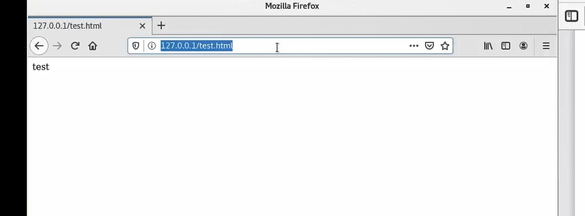

---
## Front matter
lang: ru-RU
title: Лабораторная работа №6
author: |
	Алескеров Тимур
institute: |
	 RUDN University, Moscow, Russian Federation
date: Ноябрь, 2021 Москва

## Formatting
toc: false
slide_level: 2
theme: metropolis
sansfont: NotoMono-Regular
header-includes: 
 - \metroset{progressbar=frametitle,sectionpage=progressbar,numbering=fraction}
 - '\makeatletter'
 - '\beamer@ignorenonframefalse'
 - '\makeatother'
aspectratio: 43
section-titles: true
---

# Прагматика выполнения лабораторной работы

Security Enhanced Linux может работать двумя различными способами:

Enforcing:  SELinux запрещает доступ на основе правил политики SELinux, набора руководящих принципов, которые управляют механизмом безопасности.
Permissive:SELinux не запрещает доступ, но в журнале регистрируются отказы для действий, которые были бы запрещены при запуске в принудительном режиме.
SELinux также можно отключить.

# Цель работы

## Цель работы

Развить навыки администрирования ОС Linux. Получить первое практическое знакомство с технологией SELinux.
Проверить работу SELinx на практике совместно с веб-сервером Apache

# Задачи

## Задачи

1. Запустить серверо
2. Настроить права дотупа к файлам
3. Поменять порт сервера

# Результат

## Обратимся к файлу через веб-сервер. Убедимся, что файл был успешно отображён.

{ #fig:008 width=70% }

## Вывод

В ходе данной лабораторной работы мы развили навыки
администрирования ОС Linux, впервые практически познакомились с технологией
SELinux1 и проверили работу SELinux на практике совместно с веб-сервером Apache.

## {.standout}

Спасибо за внимание!
