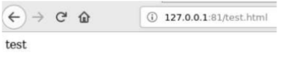

---
# Front matter
title: "Лабораторнаяработа № 6"
subtitle: "Мандатное разграничение прав в Linux"
author: "Алескеров Тимур Магомедович НБибд-01-18"

# Generic otions
lang: ru-RU
toc-title: "Содержание"

# Bibliography
bibliography: bib/cite.bib
csl: pandoc/csl/gost-r-7-0-5-2008-numeric.csl

# Pdf output format
toc: true # Table of contents
toc_depth: 2
lof: true # List of figures
lot: true # List of tables
fontsize: 12pt
linestretch: 1.5
papersize: a4
documentclass: scrreprt
## I18n
polyglossia-lang:
  name: russian
  options:
	- spelling=modern
	- babelshorthands=true
polyglossia-otherlangs:
  name: english
### Fonts
mainfont: PT Serif
romanfont: PT Serif
sansfont: PT Sans
monofont: PT Mono
mainfontoptions: Ligatures=TeX
romanfontoptions: Ligatures=TeX
sansfontoptions: Ligatures=TeX,Scale=MatchLowercase
monofontoptions: Scale=MatchLowercase,Scale=0.9
## Biblatex
biblatex: true
biblio-style: "gost-numeric"
biblatexoptions:
  - parentracker=true
  - backend=biber
  - hyperref=auto
  - language=auto
  - autolang=other*
  - citestyle=gost-numeric
## Misc options
indent: true
header-includes:
  - \linepenalty=10 # the penalty added to the badness of each line within a paragraph (no associated penalty node) Increasing the value makes tex try to have fewer lines in the paragraph.
  - \interlinepenalty=0 # value of the penalty (node) added after each line of a paragraph.
  - \hyphenpenalty=50 # the penalty for line breaking at an automatically inserted hyphen
  - \exhyphenpenalty=50 # the penalty for line breaking at an explicit hyphen
  - \binoppenalty=070 # the penalty for breaking a line at a binary operator
  - \relpenalty=050 # the penalty for breaking a line at a relation
  - \clubpenalty=150 # extra penalty for breaking after first line of a paragraph
  - \widowpenalty=150 # extra penalty for breaking before last line of a paragraph
  - \displaywidowpenalty=50 # extra penalty for breaking before last line before a display math
  - \brokenpenalty=010 # extra penalty for page breaking after a hyphenated line
  - \predisplaypenalty=10000 # penalty for breaking before a display
  - \postdisplaypenalty=0 # penalty for breaking after a display
  - \floatingpenalty = 20000 # penalty for splitting an insertion (can only be split footnote in standard LaTeX)
  - \raggedbottom # or \flushbottom
  - \usepackage{float} # keep figures where there are in the text
  - \floatplacement{figure}{H} # keep figures where there are in the text
  - \usepackage{rotating}
  - \usepackage{tabularx}
---

# Цель работы

Развить навыки администрирования ОС Linux. Получить первое практическое знакомство с технологией SELinux.
Проверить работу SELinx на практике совместно с веб-сервером Apache

# Задание

1. Запустить серверо
2. Настроить права дотупа к файлам
3. Поменять порт сервера

# Теоретическое введение

Security Enhanced Linux может работать двумя различными способами:

Enforcing:  SELinux запрещает доступ на основе правил политики SELinux, набора руководящих принципов, которые управляют механизмом безопасности.
Permissive:SELinux не запрещает доступ, но в журнале регистрируются отказы для действий, которые были бы запрещены при запуске в принудительном режиме.
SELinux также можно отключить.

Хотя это не сам режим работы, это все же вариант.

Однако научиться использовать этот инструмент лучше, чем просто игнорировать его. Имейте это в виду!

Чтобы отобразить текущий режим SELinux, используйте getenforce.

Если вы хотите переключить режим работы, используйте setenforce 0 (чтобы установить для него Permissive) или setenforce 1 (Enforcing).

Поскольку это изменение не выдержит перезагрузки, вам потребуется отредактировать файл /etc/selinux/config и установить для переменной SELINUX значениеenforcing, permissive, или disabled, чтобы обеспечить постоянство при перезагрузках:

Напомним, что если Getenforce возвращает Disabled, вам нужно отредактировать /etc/selinux/config с нужным режимом работы и перезагрузиться.

В противном случае вы не сможете установить (или переключить) режим работы с помощью setenforce.

Одно из типичных применений setenforce состоит в переключении между режимами SELinux (от принудительного к разрешающему или наоборот) для устранения неполадок в работе приложения, которое работает неправильно или работает не так, как ожидалось.

Если оно работает после того, как вы установили SELinux в режим Permissive, вы можете быть уверены, что надо рыться в проблеме с разрешениями SELinux.

Два классических случая, когда нам, скорее всего, придется иметь дело с SELinux:

Изменение порта по умолчанию, на котором слушает демон.
Установка директивы DocumentRoot для виртуального хоста вне /var/www/html.
[@lossit:wiki]

# Выполнение лабораторной работы

1. Предварительно настроил систему, установил необходимые утилиты.

2. Войдем в систему с полученными учётными данными и убедимся, что SELinux
работает в режиме enforcing политики targeted с помощью команд
getenforce и sestatus
 (рис. [-@fig:001]):

{ #fig:001 width=70% }

3. Обратимся с помощью браузера к веб-серверу, запущенному на компьютере, и
убедимся, что последний работает:
service httpd status

 (рис. [-@fig:003]).

{ #fig:003 width=70% }

4. Найдем веб-сервер Apache в списке процессов, определим его контекст
безопасности. Например, можно использовать команду
ps auxZ | grep httpd или ps -eZ | grep httpd

 (рис. [-@fig:004]). 

{ #fig:004 width=70% }

5. Посмотрим текущее состояние переключателей SELinux для Apache с помощью
команды sestatus –b | grep httpd, обращая внимание, что многие из них находятся
в положении «off».

(рис. [-@fig:005]). 

{ #fig:005 width=70% }

6. Посмотрим статистику по политике с помощью команды seinfo, также
определим множество пользователей, ролей, типов. (рис. [-@fig:006]). 

{ #fig:006 width=70% }

7. СОпределим тип файлов и поддиректорий, находящихся в директории /var/www,
с помощью команды ls -lZ /var/www
Определим тип файлов, находящихся в директории /var/www/html: ls -lZ
/var/www/html (рис. [-@fig:006])

8. Определим круг пользователей, которым разрешено создание файлов в
директории /var/www/html.
Создание файлов в директории разрешено только суперпользователю.Создадим
от имени суперпользователя (так как в дистрибутиве после установки только ему
разрешена запись в директорию) html-файл /var/www/html/test.html следующего
содержания:
<html>
<body>test</body>
</html>

 (рис. [-@fig:007])

{ #fig:007 width=70% }

9. Обратимся к файлу через веб-сервер. Убедимся, что файл был успешно
отображён.(рис. [-@fig:008])

{ #fig:008 width=70% }

10. Изучим справку man httpd_selinux и выясним, какие контексты файлов
определены для httpd. Сопоставим их с типом файла test.html. Проверить
контекст файла можно командой ls -Z.
ls -Z /var/www/html/test.html
SELinux требует наличия у файлов расширенных атрибутов, определяющих
тип файла. Политика управляет видом доступа демона к этим файлам. Политика
SELinux для демона httpd позволяет пользователям настроить web-службы
максимально безопасным методом с высокой степенью гибкости.
рис. [-@fig:009])

{ #fig:009 width=70% }

11. Попробуем ещё раз получить доступ к файлу через веб-сервер, введя в браузере
адрес http://127.0.0.1/test.html. Однако, мы получаем сообщение об ошибке: (рис. [-@fig:010])

{ #fig:010 width=70% }

12. Проанализируем ситуацию. Почему файл не был отображён, если права доступа
позволяют читать этот файл любому пользователю?
Из-за смены контекста доступ к файлу из браузера запрещен. SELinux требует
наличия у файлов расширенных атрибутов, определяющих тип файла.
ls -l /var/www/html/test.html
Просмотрим log-файлы веб-сервера Apache. Также просмотрим системный
лог-файл:
tail /var/log/messages 
Если в системе окажутся запущенными процессы setroubleshootd и audtd, то
мы также сможем увидеть ошибки, аналогичные указанным выше, в файле
/var/log/audit/audit.log. 

13. Попробуем запустить веб-сервер Apache на прослушивание ТСР-порта 81 (а не
80, как рекомендует IANA и прописано в /etc/services). Для этого в файле
/etc/httpd/httpd.conf найдем строчку Listen 80 и заменим её на Listen 81.
 (рис. [-@fig:011])

{ #fig:011 width=70% }

14. Выполним перезапуск веб-сервера Apache и проанализируем лог-файлы: tail –nl
/var/log/messages.
Просмотрим файлы и выясним, в каких файлах появились записи:
/var/log/http/error_log
/var/log/http/access_log
/var/log/audit/audit.log

Перезапуск прошел успешно, т.к. 81 порт в данной системе прописан в
политике. Ошибок не выскочило, только записи о перезапуске.

15. Выполним команду
semanage port -a -t http_port_t -р tcp 81
После этого проверим список портов командой
semanage port -l | grep http_port_t
Убедимся, что порт 81 появился в списке. Команда ни на что не повлияла,
порт там уже был. В списке есть.
(рис. [-@fig:012])

{ #fig:012 width=70% }

16. Попробуем запустить веб-сервер Apache ещё раз. Поняли ли вы, почему он
сейчас запустился, а в предыдущем случае не смог?
Успешно перезапустили. И тогда, и сейчас это было успешно, т.к. порт 81 уже
был прописан.

17. Вернем контекст httpd_sys_cоntent__t к файлу /var/www/html/ test.html:
chcon -t httpd_sys_content_t /var/www/html/test.html
После этого попробуем получить доступ к файлу через веб-сервер, введя в
браузере адрес http://127.0.0.1:81/test.html. Мы видим содержимое файла – слово
«test». (рис. [-@fig:013])

{ #fig:013 width=70% }

18. Исправим обратно конфигурационный файл apache, вернув Listen 80.

19. Удалим привязку http_port_t к 81 порту:
semanage port -d -t http_port_t -p tcp 81

20. Удалим файл /var/www/html/test.html:
rm /var/www/html/test.html

# Выводы

В ходе данной лабораторной работы мы развили навыки
администрирования ОС Linux, впервые практически познакомились с технологией
SELinux1 и проверили работу SELinux на практике совместно с веб-сервером Apache.

# Список литературы{.unnumbered}

::: {#refs}
:::
