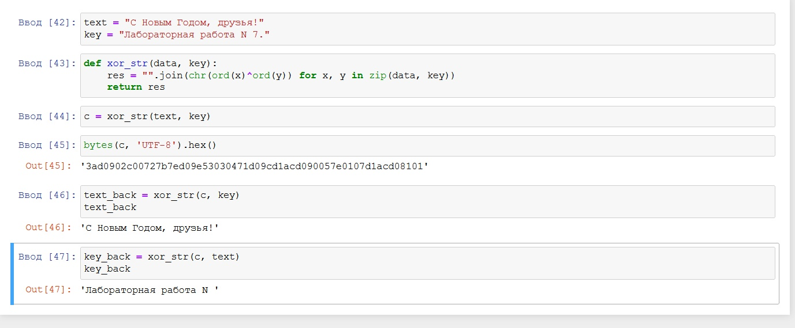

---
## Front matter
lang: ru-RU
title: Лабораторная работа №7
author: |
	Алескеров Тимур
institute: |
	 RUDN University, Moscow, Russian Federation
date: Декабрь, 2021 Москва

## Formatting
toc: false
slide_level: 2
theme: metropolis
sansfont: NotoMono-Regular
header-includes: 
 - \metroset{progressbar=frametitle,sectionpage=progressbar,numbering=fraction}
 - '\makeatletter'
 - '\beamer@ignorenonframefalse'
 - '\makeatother'
aspectratio: 43
section-titles: true
---

# Прагматика выполнения лабораторной работы

Проблемой защиты информации при ее передаче между абонентами люди занимаются на протяжении всей своей истории. Человечеством изобретено множество способов, позволяющих в той или иной мере скрыть смысл передаваемых сообщений от противника.
В этой лабораторнй работе мы изучили один из методов шифрования - метод однократного гаммирования.

# Цель работы

## Цель работы

Освоить на практике применение режима однократного гаммирования

# Задачи

## Задачи

Нужно подобрать ключ, чтобы получить сообщение «С Новым Годом,
друзья!». Требуется разработать приложение, позволяющее шифровать и
дешифровать данные в режиме однократного гаммирования. Приложение
должно:

1. Определить вид шифротекста при известном ключе и известном открытом тексте.

2. Определить ключ, с помощью которого шифротекст может быть преобразован в некоторый фрагмент текста, представляющий собой один из
возможных вариантов прочтения открытого текста.

# Результат

## Программа шифрования

{ #fig:001 width=70% }

## Вывод

В ходе данной лабораторной работы я освоил применение режима
однократного гаммирования на практике, разработал приложение, позволяющее
шифровать и дешифровать данные в режиме однократного гаммирования.

## {.standout}

Спасибо за внимание!
