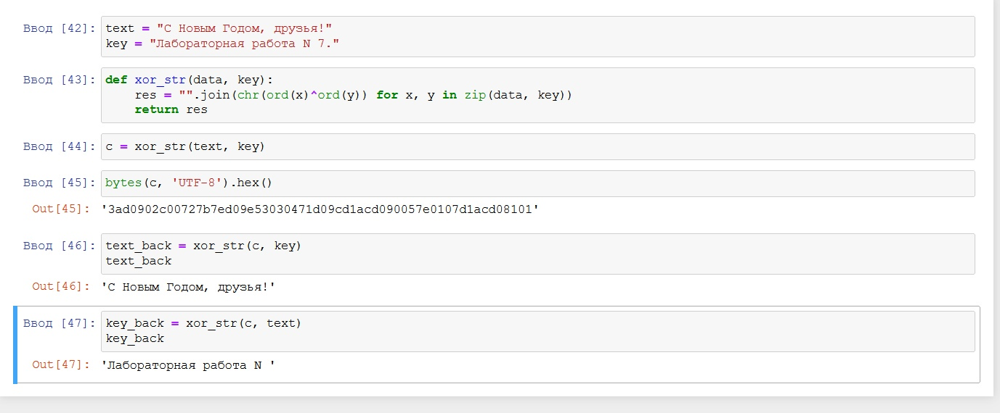

---
# Front matter
title: "Лабораторнаяработа № 7"
subtitle: "Элементы криптографии. Однократное гаммирование"
author: "Алескеров Тимур Магомедович НБибд-01-18"

# Generic otions
lang: ru-RU
toc-title: "Содержание"

# Bibliography
bibliography: bib/cite.bib
csl: pandoc/csl/gost-r-7-0-5-2008-numeric.csl

# Pdf output format
toc: true # Table of contents
toc_depth: 2
lof: true # List of figures
lot: true # List of tables
fontsize: 12pt
linestretch: 1.5
papersize: a4
documentclass: scrreprt
## I18n
polyglossia-lang:
  name: russian
  options:
	- spelling=modern
	- babelshorthands=true
polyglossia-otherlangs:
  name: english
### Fonts
mainfont: PT Serif
romanfont: PT Serif
sansfont: PT Sans
monofont: PT Mono
mainfontoptions: Ligatures=TeX
romanfontoptions: Ligatures=TeX
sansfontoptions: Ligatures=TeX,Scale=MatchLowercase
monofontoptions: Scale=MatchLowercase,Scale=0.9
## Biblatex
biblatex: true
biblio-style: "gost-numeric"
biblatexoptions:
  - parentracker=true
  - backend=biber
  - hyperref=auto
  - language=auto
  - autolang=other*
  - citestyle=gost-numeric
## Misc options
indent: true
header-includes:
  - \linepenalty=10 # the penalty added to the badness of each line within a paragraph (no associated penalty node) Increasing the value makes tex try to have fewer lines in the paragraph.
  - \interlinepenalty=0 # value of the penalty (node) added after each line of a paragraph.
  - \hyphenpenalty=50 # the penalty for line breaking at an automatically inserted hyphen
  - \exhyphenpenalty=50 # the penalty for line breaking at an explicit hyphen
  - \binoppenalty=070 # the penalty for breaking a line at a binary operator
  - \relpenalty=050 # the penalty for breaking a line at a relation
  - \clubpenalty=150 # extra penalty for breaking after first line of a paragraph
  - \widowpenalty=150 # extra penalty for breaking before last line of a paragraph
  - \displaywidowpenalty=50 # extra penalty for breaking before last line before a display math
  - \brokenpenalty=010 # extra penalty for page breaking after a hyphenated line
  - \predisplaypenalty=10000 # penalty for breaking before a display
  - \postdisplaypenalty=0 # penalty for breaking after a display
  - \floatingpenalty = 20000 # penalty for splitting an insertion (can only be split footnote in standard LaTeX)
  - \raggedbottom # or \flushbottom
  - \usepackage{float} # keep figures where there are in the text
  - \floatplacement{figure}{H} # keep figures where there are in the text
  - \usepackage{rotating}
  - \usepackage{tabularx}
---

# Цель работы

Освоить на практике применение режима однократного гаммирования

# Задание

Нужно подобрать ключ, чтобы получить сообщение «С Новым Годом,
друзья!». Требуется разработать приложение, позволяющее шифровать и
дешифровать данные в режиме однократного гаммирования. Приложение
должно:
1. Определить вид шифротекста при известном ключе и известном открытом тексте.
2. Определить ключ, с помощью которого шифротекст может быть преобразован в некоторый фрагмент текста, представляющий собой один из
возможных вариантов прочтения открытого текста.

# Теоретическое введение

Еще одним частным случаем многоалфавитной подстановки является гаммирование. В этом способе шифрование выполняется путем сложения символов исходного текста и ключа по модулю, равному числу букв в алфавите. Если в исходном алфавите, например, 33 символа, то сложение производится по модулю 33. Такой процесс сложения исходного текста и ключа называется в криптографии наложением гаммы.

Пусть символам исходного алфавита соответствуют числа от 0 (А) до 32 (Я). Если обозначить число, соответствующее исходному символу, x, а символу ключа – k, то можно записать правило гаммирования следующим образом:

z = x + k (mod N),
где z – закодированный символ, N - количество символов в алфавите, а сложение по модулю N - операция, аналогичная обычному сложению, с тем отличием, что если обычное суммирование дает результат, больший или равный N, то значением суммы считается остаток от деления его на N. Например, пусть сложим по модулю 33 символы Г (3) и Ю (31):

3 + 31 (mod 33) = 1,
то есть в результате получаем символ Б, соответствующий числу 1.

Наиболее часто на практике встречается двоичное гаммирование. При этом используется двоичный алфавит, а сложение производится по модулю два. Операция сложения по модулю 2 часто обозначается \oplus, то есть можно записать:

z = x + k (mod 2) = x \oplus k.
Операция сложения по модулю два в алгебре логики называется также "исключающее ИЛИ" или по-английски XOR.

Рассмотрим пример. Предположим, нам необходимо зашифровать десятичное число 14 методом гаммирования с использованием ключа 12. Для этого вначале необходимо преобразовать исходное число и ключ (гамму) в двоичную форму: 14(10)=1110(2), 12(10)=1100(2). Затем надо записать полученные двоичные числа друг под другом и каждую пару символов сложить по модулю два. При сложении двух двоичных знаков получается 0, если исходные двоичные цифры одинаковы, и 1, если цифры разные:

0 \oplus 0 = 0\\
0 \oplus 1 = 1\\
1 \oplus 0 = 1\\
1 \oplus 1 = 0\\
Сложим по модулю два двоичные числа 1110 и 1100:

Исходное число 1 1 1 0
Гамма    1 1 0 0
Результат   0 0 1 0
В результате сложения получили двоичное число 0010. Если перевести его в десятичную форму, получим 2. Таким образом, в результате применения к числу 14 операции гаммирования с ключом 12 получаем в результате число 2.

Каким же образом выполняется расшифрование? Зашифрованное число 2 представляется в двоичном виде и снова производится сложение по модулю 2 с ключом:

Зашифрованное число 0 0 1 0
Гамма     1 1 0 0
Результат    1 1 1 0
Переведем полученное двоичное значение 1110 в десятичный вид и получим 14, то есть исходное число.

Таким образом, при гаммировании по модулю 2 нужно использовать одну и ту же операцию как для зашифрования, так и для расшифрования. Это позволяет использовать один и тот же алгоритм, а соответственно и одну и ту же программу при программной реализации, как для шифрования, так и для расшифрования.

Операция сложения по модулю два очень быстро выполняется на компьютере (в отличие от многих других арифметических операций), поэтому наложение гаммы даже на очень большой открытый текст выполняется практически мгновенно.

Благодаря указанным достоинствам метод гаммирования широко применяется в современных технических системах сам по себе, а также как элемент комбинированных алгоритмов шифрования.

Сформулируем, как производится гаммирование по модулю 2 в общем случае:

символы исходного текста и гамма представляются в двоичном коде и располагаются один под другим, при этом ключ (гамма) записывается столько раз, сколько потребуется;
каждая пара двоичных знаков складывается по модулю два;
полученная последовательность двоичных знаков кодируется символами алфавита в соответствии с выбранным кодом.

При использовании метода гаммирования ключом является последовательность, с которой производится сложение – гамма. Если гамма короче, чем сообщение, предназначенное для зашифрования, гамма повторяется требуемое число раз.
[@lossit:wiki]

# Выполнение лабораторной работы

В качестве компилятора используем jupiter notebook.
Необходимо помнить условия абсолютной стойкости шифра:
 - полная случайность ключа;
 - равенство длин ключа и открытого текста;
 - однократное использование ключа.

{ #fig:013 width=70% }

Код:
text = "С Новым Годом, друзья!"
key = "Лабораторная работа N 7."

def xor_str(data, key):
    res = "".join(chr(ord(x)^ord(y)) for x, y in zip(data, key))
    return res

c = xor_str(text, key)

print(bytes(c, 'UTF-8').hex())

text_back = xor_str(c, key)
text_back

key_back = xor_str(c, text)
print(key_back)

Контрольные вопросы.

1. Поясните смысл однократного гаммирования.

Принцип гаммирования представляет собой процедуру наложения, при помощи
некой функции G, на входную информационную последовательность гаммы
шифра, т.е. псевдослучайной последовательности.

2. Перечислите недостатки однократного гаммирования.

Недостатки однократного гаммирования заключается в необходимости иметь
огромные объемы данных, которые можно было бы использовать в качестве
гаммы.

3. Перечислите преимущества однократного гаммирования.

Преимущества однократного гаммирования в том, что не может сказать о
дешифровке, верна она или нет из-за равных априорных вероятностей
криптоаналитик. Информация о вскрытом участке гаммы не дает информации об
остальных ее частях.

4. Почему длина открытого текста должна совпадать с длиной ключа?

Так должно быть, потому что мы используем поэлементное перемножение,
чтобы размерность шифртекста была равна размерности открытого текста и
ключа. Также это ее необходимость заключается в том, чтобы шифрование и
расшифрование выполнялось одной и той же программой.

5. Какая операция используется в режиме однократного гаммирования, назовите
её особенности?

В режиме однократного гаммирования используется операция сложения по
модулю 2 (XOR). Двойное прибавление одной и той же величины по модулю 2
восстанавливает исходное значение.

6. Как по открытому тексту и ключу получить шифротекст?

Задача нахождения шифротекста при известном ключе и открытом тексте
состоит в применение следующего правила к каждому символу открытого текста:
Ci = Pi xor Ki.

7. Как по открытому тексту и шифротексту получить ключ?
Обе части равенства сложим по модулю 2 с Pi.
Ci xor Pi = Pi xor Ki xor Pi = Ki,
Ki = Ci xor Pi.

8. В чем заключаются необходимые и достаточные условия абсолютной
стойкости шифра?

Необходимые и достаточные условия абсолютной стойкости шифра включают в
себя полную случайность ключа, равенство длин ключа и открытого текста,
однократное использование ключа.

# Выводы

в ходе данной лабораторной работы я освоил применение режима
однократного гаммирования на практике, разработал приложение, позволяющее
шифровать и дешифровать данные в режиме однократного гаммирования.

# Список литературы{.unnumbered}

::: {#refs}
:::
