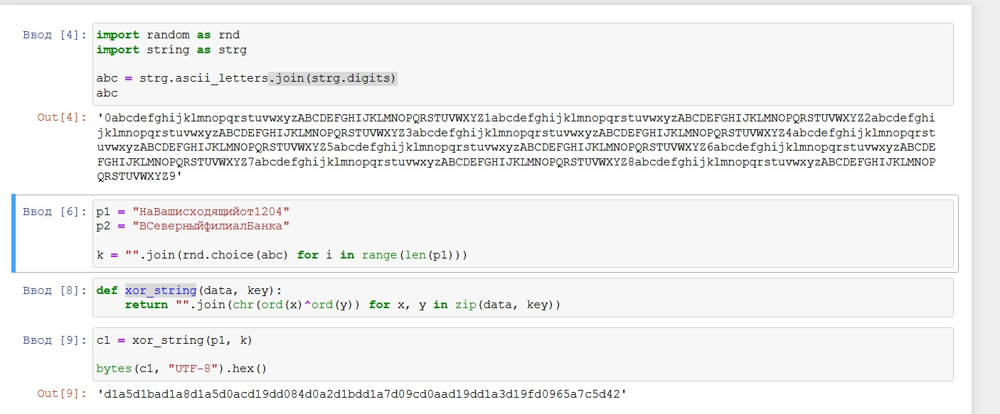
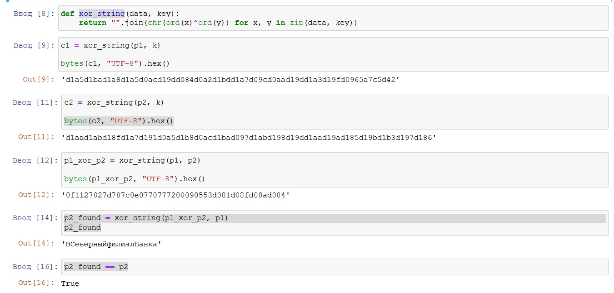
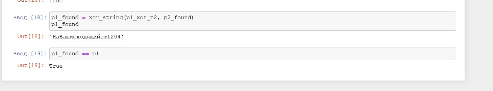

---
## Front matter
lang: ru-RU
title: Лабораторная работа №8
author: |
	Алескеров Тимур
institute: |
	 RUDN University, Moscow, Russian Federation
date: Декабрь, 2021 Москва

## Formatting
toc: false
slide_level: 2
theme: metropolis
sansfont: NotoMono-Regular
header-includes: 
 - \metroset{progressbar=frametitle,sectionpage=progressbar,numbering=fraction}
 - '\makeatletter'
 - '\beamer@ignorenonframefalse'
 - '\makeatother'
aspectratio: 43
section-titles: true
---

# Прагматика выполнения лабораторной работы

Проблемой защиты информации при ее передаче между абонентами люди занимаются на протяжении всей своей истории. Человечеством изобретено множество способов, позволяющих в той или иной мере скрыть смысл передаваемых сообщений от противника.
В этой лабораторнй работе мы изучили один из методов шифрования - метод однократного гаммирования.

# Цель работы

## Цель работы

Освоить на практике применение режима однократного гаммирования на примере кодирования различных исходных текстов одним ключом.

# Задачи

## Задачи

Два текста кодируются одним ключом (однократное гаммирование).
Требуется не зная ключа и не стремясь его определить, прочитать оба текста. Необходимо разработать приложение, позволяющее шифровать и дешифровать тексты P1 и P2 в режиме однократного гаммирования. Приложение должно определить вид шифротекстов C1 и C2 обоих текстов P1 и
P2 при известном ключе ; Необходимо определить и выразить аналитически способ, при котором злоумышленник может прочитать оба текста, не
зная ключа и не стремясь его определить

# Результат

## Программа шифрования

{ #fig:001 width=70% }

## Программа шифрования

{ #fig:002 width=70% }

## Программа шифрования

{ #fig:003 width=70% }

## Вывод

В ходе данной лабораторной работы я освоил на практике применение
режима однократного гаммирования на примере кодирования различных исходных
текстов одним ключом, разработал приложение, позволяющие шифровать и
дешифровать различные тексты в режиме однократного гаммирования.

## {.standout}

Спасибо за внимание!
