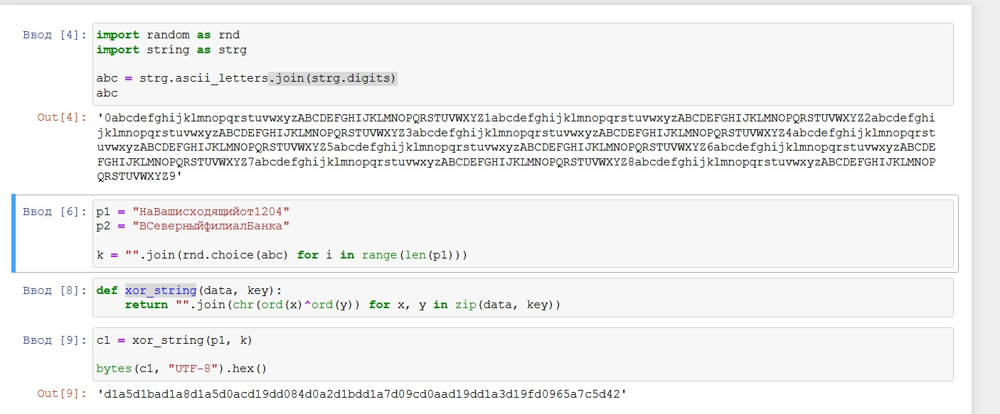
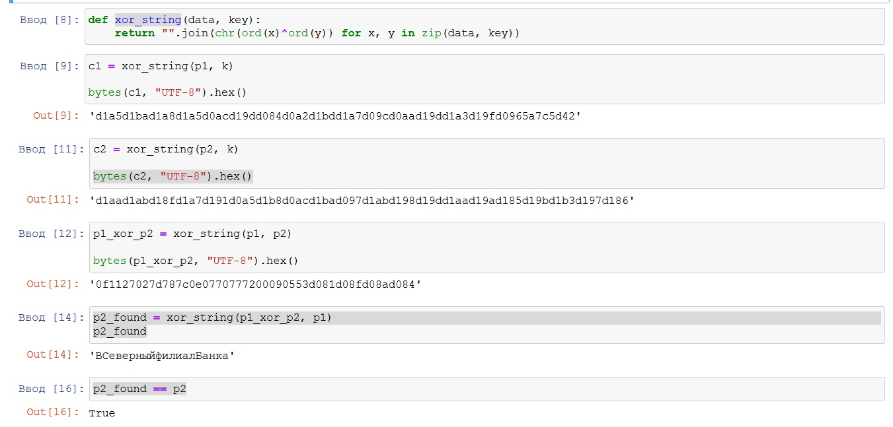
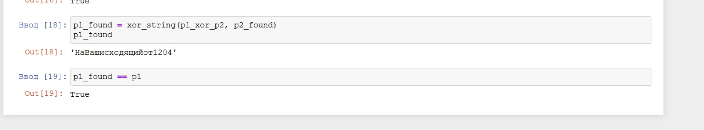

---
# Front matter
title: "Лабораторнаяработа № 8"
subtitle: "Элементы криптографии. Шифрование (кодирование) различных исходных текстов одним ключом"
author: "Алескеров Тимур Магомедович НБибд-01-18"

# Generic otions
lang: ru-RU
toc-title: "Содержание"

# Bibliography
bibliography: bib/cite.bib
csl: pandoc/csl/gost-r-7-0-5-2008-numeric.csl

# Pdf output format
toc: true # Table of contents
toc_depth: 2
lof: true # List of figures
lot: true # List of tables
fontsize: 12pt
linestretch: 1.5
papersize: a4
documentclass: scrreprt
## I18n
polyglossia-lang:
  name: russian
  options:
	- spelling=modern
	- babelshorthands=true
polyglossia-otherlangs:
  name: english
### Fonts
mainfont: PT Serif
romanfont: PT Serif
sansfont: PT Sans
monofont: PT Mono
mainfontoptions: Ligatures=TeX
romanfontoptions: Ligatures=TeX
sansfontoptions: Ligatures=TeX,Scale=MatchLowercase
monofontoptions: Scale=MatchLowercase,Scale=0.9
## Biblatex
biblatex: true
biblio-style: "gost-numeric"
biblatexoptions:
  - parentracker=true
  - backend=biber
  - hyperref=auto
  - language=auto
  - autolang=other*
  - citestyle=gost-numeric
## Misc options
indent: true
header-includes:
  - \linepenalty=10 # the penalty added to the badness of each line within a paragraph (no associated penalty node) Increasing the value makes tex try to have fewer lines in the paragraph.
  - \interlinepenalty=0 # value of the penalty (node) added after each line of a paragraph.
  - \hyphenpenalty=50 # the penalty for line breaking at an automatically inserted hyphen
  - \exhyphenpenalty=50 # the penalty for line breaking at an explicit hyphen
  - \binoppenalty=070 # the penalty for breaking a line at a binary operator
  - \relpenalty=050 # the penalty for breaking a line at a relation
  - \clubpenalty=150 # extra penalty for breaking after first line of a paragraph
  - \widowpenalty=150 # extra penalty for breaking before last line of a paragraph
  - \displaywidowpenalty=50 # extra penalty for breaking before last line before a display math
  - \brokenpenalty=010 # extra penalty for page breaking after a hyphenated line
  - \predisplaypenalty=10000 # penalty for breaking before a display
  - \postdisplaypenalty=0 # penalty for breaking after a display
  - \floatingpenalty = 20000 # penalty for splitting an insertion (can only be split footnote in standard LaTeX)
  - \raggedbottom # or \flushbottom
  - \usepackage{float} # keep figures where there are in the text
  - \floatplacement{figure}{H} # keep figures where there are in the text
  - \usepackage{rotating}
  - \usepackage{tabularx}
---

# Цель работы

Освоить на практике применение режима однократного гаммирования на примере кодирования различных исходных текстов одним ключом.

# Задание

Два текста кодируются одним ключом (однократное гаммирование).
Требуется не зная ключа и не стремясь его определить, прочитать оба текста. Необходимо разработать приложение, позволяющее шифровать и дешифровать тексты P1 и P2 в режиме однократного гаммирования. Приложение должно определить вид шифротекстов C1 и C2 обоих текстов P1 и
P2 при известном ключе ; Необходимо определить и выразить аналитически способ, при котором злоумышленник может прочитать оба текста, не
зная ключа и не стремясь его определить

# Теоретическое введение

Еще одним частным случаем многоалфавитной подстановки является гаммирование. В этом способе шифрование выполняется путем сложения символов исходного текста и ключа по модулю, равному числу букв в алфавите. Если в исходном алфавите, например, 33 символа, то сложение производится по модулю 33. Такой процесс сложения исходного текста и ключа называется в криптографии наложением гаммы.

Пусть символам исходного алфавита соответствуют числа от 0 (А) до 32 (Я). Если обозначить число, соответствующее исходному символу, x, а символу ключа – k, то можно записать правило гаммирования следующим образом:

z = x + k (mod N),

где z – закодированный символ, N - количество символов в алфавите, а сложение по модулю N - операция, аналогичная обычному сложению, с тем отличием, что если обычное суммирование дает результат, больший или равный N, то значением суммы считается остаток от деления его на N. Например, пусть сложим по модулю 33 символы Г (3) и Ю (31):

3 + 31 (mod 33) = 1,

то есть в результате получаем символ Б, соответствующий числу 1.

Наиболее часто на практике встречается двоичное гаммирование. При этом используется двоичный алфавит, а сложение производится по модулю два. Операция сложения по модулю 2 часто обозначается xor, то есть можно записать:

z = x + k (mod 2) = x xor k.

Операция сложения по модулю два в алгебре логики называется также "исключающее ИЛИ" или по-английски XOR.

Рассмотрим пример. Предположим, нам необходимо зашифровать десятичное число 14 методом гаммирования с использованием ключа 12. Для этого вначале необходимо преобразовать исходное число и ключ (гамму) в двоичную форму: 14(10)=1110(2), 12(10)=1100(2). Затем надо записать полученные двоичные числа друг под другом и каждую пару символов сложить по модулю два. При сложении двух двоичных знаков получается 0, если исходные двоичные цифры одинаковы, и 1, если цифры разные:

0 xor 0 = 0

0 xor 1 = 1

1 xor 0 = 1

1 xor 1 = 0

Сложим по модулю два двоичные числа 1110 и 1100:

Исходное число 1 1 1 0

Гамма    1 1 0 0

Результат   0 0 1 0

В результате сложения получили двоичное число 0010. Если перевести его в десятичную форму, получим 2. Таким образом, в результате применения к числу 14 операции гаммирования с ключом 12 получаем в результате число 2.

Каким же образом выполняется расшифрование? Зашифрованное число 2 представляется в двоичном виде и снова производится сложение по модулю 2 с ключом:

Зашифрованное число 0 0 1 0

Гамма     1 1 0 0

Результат    1 1 1 0

Переведем полученное двоичное значение 1110 в десятичный вид и получим 14, то есть исходное число.

Таким образом, при гаммировании по модулю 2 нужно использовать одну и ту же операцию как для зашифрования, так и для расшифрования. Это позволяет использовать один и тот же алгоритм, а соответственно и одну и ту же программу при программной реализации, как для шифрования, так и для расшифрования.

Операция сложения по модулю два очень быстро выполняется на компьютере (в отличие от многих других арифметических операций), поэтому наложение гаммы даже на очень большой открытый текст выполняется практически мгновенно.

Благодаря указанным достоинствам метод гаммирования широко применяется в современных технических системах сам по себе, а также как элемент комбинированных алгоритмов шифрования.

Сформулируем, как производится гаммирование по модулю 2 в общем случае:

символы исходного текста и гамма представляются в двоичном коде и располагаются один под другим, при этом ключ (гамма) записывается столько раз, сколько потребуется;
каждая пара двоичных знаков складывается по модулю два;
полученная последовательность двоичных знаков кодируется символами алфавита в соответствии с выбранным кодом.

При использовании метода гаммирования ключом является последовательность, с которой производится сложение – гамма. Если гамма короче, чем сообщение, предназначенное для зашифрования, гамма повторяется требуемое число раз.
[@lossit:wiki]

# Выполнение лабораторной работы

В качестве компилятора используем jupiter notebook.  (рис. [-@fig:001])  (рис. [-@fig:002]) (рис. [-@fig:003])

Необходимо помнить условия абсолютной стойкости шифра:

 - полная случайность ключа;
 
 - равенство длин ключа и открытого текста;
 
 - однократное использование ключа.

{ #fig:001 width=70% }

{ #fig:002 width=70% }

{ #fig:003 width=70% }

Код:

import random as rnd

import string as strg

abc = strg.ascii_letters.join(strg.digits)

print(abc)

p1 = "НаВашисходящийот1204"

p2 = "ВСеверныйфилиалБанка"

k = "".join(rnd.choice(abc) for i in range(len(p1)))

def xor_string(data, key):

    return "".join(chr(ord(x)^ord(y)) for x, y in zip(data, key))

c1 = xor_string(p1, k)

print(bytes(c1, "UTF-8").hex())

c2 = xor_string(p2, k)

print(bytes(c2, "UTF-8").hex())

p1_xor_p2 = xor_string(p1, p2)

print(bytes(p1_xor_p2, "UTF-8").hex())

p2_found = xor_string(p1_xor_p2, p1)

print(p2_found)

print(p2_found == p2)

p1_found = xor_string(p1_xor_p2, p2_found)

print(p1_found)

print(p1_found == p1)

# Контрольные вопросы.

1. Как, зная один из текстов (P1 или P2), определить другой, не зная при
этом ключа?

С помощью формул режима однократного гаммирования получим
шифротексты обеих телеграмм:

С1 = Р1 xor К,

С2 = Р2 xor К.

Задача нахождения открытого текста по известному шифротексту двух
телеграмм, зашифрованных одним ключом, может быть решена. Сложим по модулю
2 оба равенства, получаем:

С1 xor С2 = Р1 xor К xor Р2 xor К = Р1 xor Р2.

имеем:

С1 xor С2 xor Р1 = Р1 xor Р2 xor Р1 = Р2.

Таким образом, получаем возможность определить те символы сообщения Р2,
которые находятся на позициях известного сообщения Р1. Догадываясь по логике
сообщения Р2, Имеем реальный шанс узнать ещё некоторое количество символов
сообщения Р2. Затем вместо Р1 подставляя новоузнанные символы сообщения Р2. И
так далее. Действуя подобным образом, можно если даже не прочитает оба
сообщения, то значительно уменьшит пространство их поиска.

2. Что будет при повторном использовании ключа при шифровании
текста?

Если на сообщение наложить ключ дважды, мы получим исходное сообщение.

3. Как реализуется режим шифрования однократного гаммирования
одним ключом двух открытых текстов?

Один ключ накладываем на оба открытых текста и получаем два
зашифрованных одним ключом шифротекста.

4. Перечислите недостатки шифрования одним ключом двух открытых
текстов.

Зная текст одного из сообщения можно узнать текст второго, не зная кода.

5. Перечислите преимущества шифрования одним ключом двух открытых
текстов.

Нет необходимости каждый раз придумывать ключи для каждого сообщение.

# Выводы

в ходе данной лабораторной работы я освоил на практике применение
режима однократного гаммирования на примере кодирования различных исходных
текстов одним ключом, разработал приложение, позволяющие шифровать и
дешифровать различные тексты в режиме однократного гаммирования.

# Список литературы{.unnumbered}

::: {#refs}
:::
